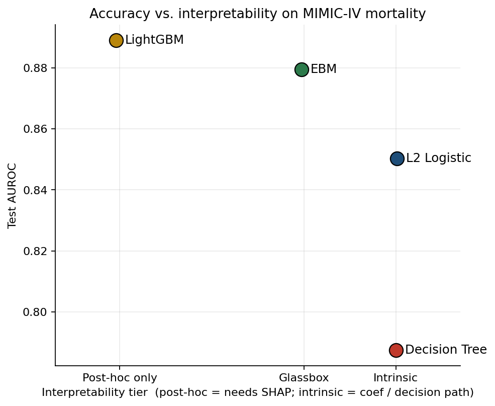

# interpretability-foundations

[](./.github/workflows/ci.yml)
[](./pyproject.toml)
[](./LICENSE)
[](#)

Five projects on making model decisions legible — from intrinsically interpretable models on
critical-care data, through faithfulness benchmarking on text classifiers, modality decomposition
for multimodal fusion, a comparison of two visual-question-answering pipelines, and a look inside
a small transformer.

> **Status.** v0.1.0 — Project 1 shipped; Projects 2-5 under active build. See `CHANGELOG.md`.



## Projects

| | Project | Question | Headline result |
|---|---|---|---|
| 1 | [`01-tabular-mimic`](projects/01-tabular-mimic) | How much accuracy do interpretable models cost on ICU mortality risk? | EBM lands within 1.0 AUROC point of LightGBM (0.879 vs 0.889) and beats it on calibration. |
| 2 | [`02-text-eraser`](projects/02-text-eraser) | Which text-classification explainer is actually faithful? | _coming soon_ |
| 3 | [`03-multimodal-hatefulmemes`](projects/03-multimodal-hatefulmemes) | How much of a fused image+text decision came from each modality? | _coming soon_ |
| 4 | [`04-vqa-aokvqa`](projects/04-vqa-aokvqa) | Do caption-then-LLM explanations actually describe the image? | _coming soon_ |
| 5 | [`05-mechanistic-pythia`](projects/05-mechanistic-pythia) | Where in a small language model does a property emerge? | _coming soon_ |

## How to read this

- **Reviewers without a Python setup.** Open the pre-rendered notebook HTML files linked from each
  project README (`projects/NN-*/notebooks/*.html`).
- **Engineers.** Start at `src/awake/` (the shared library) and `docs/decisions/` (the ADRs).
- **Reproducers.** `just setup` from the repo root, then per-project `just data && just train && just eval`.

## Repository layout

```
src/awake/        shared evaluation + plotting utilities (built reactively)
projects/         one folder per project; uniform internal layout
apps/             HuggingFace Space (Gradio) for Project 3
docs/decisions/   architecture decision records
legacy/v1/        preserved 2023 MSc coursework — not under active development
```

## Licence and contact

MIT. Maintained by [Desmond Mariita](https://github.com/Desmond-Mariita).
