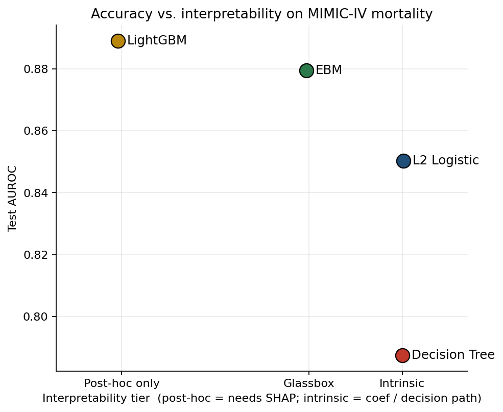

# interpretability-foundations

[](./.github/workflows/ci.yml)
[](./pyproject.toml)
[](./LICENSE)

Five projects on making model decisions legible — from intrinsically interpretable models on
critical-care data, through faithfulness benchmarking on text classifiers, modality
decomposition for multimodal fusion, a comparison of two visual-question-answering pipelines,
and a look inside a small transformer.

**Why this matters for AI assurance.** Trustworthy-AI regulation (the EU AI Act's transparency
and human-oversight duties for high-risk systems) increasingly asks a hard technical question:
*does a model's explanation actually reflect how it decided?* These projects build and stress-test
the methods that answer it — faithfulness metrics, modality attribution, calibration, and probing —
the toolkit for auditing a model, not just reporting its accuracy.

> **Status.** All five projects complete end-to-end on real data, with reproducible CI and a
> shared evaluation library. See `CHANGELOG.md`.



## Projects

| | Project | Question | Headline result |
|---|---|---|---|
| 1 | [`01-tabular-mimic`](projects/01-tabular-mimic) | What accuracy do interpretable models cost on ICU mortality risk? | Glassbox **EBM within 1.0 AUROC point of LightGBM** (0.879 vs 0.889) and **best-calibrated** of four models (Brier 0.075 vs 0.091). |
| 2 | [`02-text-eraser`](projects/02-text-eraser) | Which text-classification explainer is actually *faithful* — and is faithful the same as *plausible*? | **No.** On the ERASER Movies benchmark, **Integrated Gradients is the only faithful explainer** (comprehensiveness 0.52 vs ~0.02–0.06; p < 0.001), yet every method barely beats random on agreement with human rationales. Confident saliency maps can be no more faithful than chance. |
| 3 | [`03-multimodal-hatefulmemes`](projects/03-multimodal-hatefulmemes) | In a fused image+text decision, how much came from each modality? | **The image.** 2-player interventional modality Shapley: mean\|φ\| **image 0.84 vs text 0.68**; text-only ≈ chance (AUROC 0.575). Live Gradio Space. |
| 4 | [`04-vqa-aokvqa`](projects/04-vqa-aokvqa) | Do caption-then-LLM explanations actually describe the *image*? | A vision-ablation probe with a paired baseline measures Δ = whether the image or the model's *own rationale* drives answer recovery — across caption-then-LLM, 3B and size-matched 7B direct-VLM pipelines on A-OKVQA. |
| 5 | [`05-mechanistic-pythia`](projects/05-mechanistic-pythia) | Where in a small transformer does a property become linearly decodable? | Per-layer linear probes on Pythia-160M with **Hewitt–Liang control tasks** locate emergence by depth via *selectivity* (probe − control), with cluster-bootstrap CIs. |

## How to read this

- **Reviewers without a Python setup.** Open the pre-rendered notebook HTML linked from each
  project README (`projects/NN-*/notebooks/*.html`).
- **Engineers.** Start at `src/awake/` (the shared evaluation library) and `docs/decisions/`
  (the ADRs — each project's load-bearing decisions and their trade-offs).
- **Reproducers.** `just setup` from the repo root, then per-project `just data && just train && just eval`.

## A note on data governance

Every project that uses gated or licensed data (MIMIC-IV, Meta Hateful Memes, ERASER) is
**code-only**: the data and any data-derived embeddings are never committed or hosted, only the
methods and aggregate results. See `docs/decisions/001-mimic-code-only.md` and ADR 003 — handling
restricted data correctly is part of the work.

## Repository layout

```
src/awake/        shared evaluation + plotting utilities
projects/         one folder per project; uniform internal layout
apps/             HuggingFace Space (Gradio) for Project 3
docs/decisions/   architecture decision records
legacy/v1/        verbatim 2023 MSc coursework, preserved frozen
```
