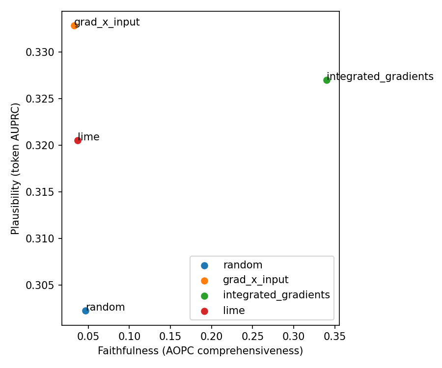

# Project 2 — Faithfulness vs. plausibility of text-classification explainers

**Author:** Desmond Mariita.
**Dataset:** ERASER Movies (publicly available; downloaded via `scripts/00_fetch_data.py`).
**Status:** end-to-end run complete on RoBERTa-base (see §3 for the model note).

---

## 1. Question and framing

When LIME, Integrated Gradients, Gradient×Input, and SHAP PartitionExplainer disagree
about which tokens drove a fine-tuned sentiment classifier's decision, which explanations
are *faithful* — they reflect what the model actually computed — and which are merely
*plausible* — they agree with how a human would read the review?  Do the two properties
coincide?

The question matters practically because an explanation that looks convincing to a human
annotator but misrepresents the model's internal logic provides a false sense of
transparency.  The ERASER benchmark (DeYoung et al. 2020) supplies both the task data
and human-annotated token rationales, which makes it possible to test both dimensions on
the same examples and to place every explainer in a single faithfulness–plausibility
scatter.

## 2. Data

**Source.** The ERASER Movies corpus — binary sentiment on IMDB-style reviews, with
human-annotated token-level rationales.  The canonical tarball is fetched once by
`scripts/00_fetch_data.py` and stored in `~/.cache/eraser/movies` (or the path set by
`ERASER_DATA_PATH`); the sha256 is verified after each download.  Nothing is committed to
the repository (see ADR 002).

**Preparation (`scripts/01_prepare.py`).**

1. The `{train,val,test}.jsonl` annotation files are joined to the whitespace-tokenised
   review files under `docs/`.  Each review is reconstructed together with its binary
   label (positive / negative) and a word-level human-rationale mask derived from the
   `evidences` span offsets.
2. **Comparison / multi-document annotations** — a ERASER Movies quirk where evidence
   spans reference a second comparison document — are detected by inspecting the
   `docid` field of each evidence span.  Any example whose evidences contain a `docid`
   other than its own review is **dropped**, with the count reported in
   `outputs/prepare_stats.json`.
3. The frozen visible sequence is built and stored (see §3 below).
4. Output: `outputs/prepared/{train,val,test}.parquet`, one row per example, with columns
   `example_id`, `tokens_visible` (list), `token_ids_visible` (list), `offsets` (list of
   `[start, end]` pairs), `gold_mask_visible` (list of 0/1), `truncation_coverage`
   (float), `label` (0 / 1).

## 3. Model

**Architecture.** `roberta-base`, fine-tuned with a binary classification head (AdamW,
linear warmup, gradient clipping). Single RTX 3090; seeds via
`awake.utils.seed_everything`.  The checkpoint SHA-256 is logged and used to invalidate
stale attribution caches at inference time. Test accuracy 0.925, macro-F1 0.925.

> **Model note.** The spec named `microsoft/deberta-v3-base`. DeBERTa-v3's disentangled
> attention diverges to NaN under this environment's stack (transformers 5.9 / torch 2.12 /
> CUDA 13) after a single finite, gradient-clipped optimiser step — an external library bug,
> reproduced at lr 1e-5 and 2e-5 with warmup and clipping. RoBERTa-base uses standard
> attention, fine-tunes cleanly here, and keeps a fast tokenizer with offsets/word_ids
> (required by the prepare and explainer steps). Dropping attention rollout (already done
> for DeBERTa's disentangled attention) means nothing in the method is DeBERTa-specific.
> See ADR 002.

**Truncation contract (the central correctness decision).**
ERASER Movies reviews average approximately 770 whitespace tokens; DeBERTa-v3-base caps
at 512 subwords.  A naive approach would re-tokenize after erasure, silently allowing
hidden tail content to slide into the visible window and changing the input under
evaluation.  We prevent this with a single frozen visible sequence per example,
established once at prepare time:

- Tokenize with `return_offsets_mapping=True`, truncate to 512 subwords.
- All downstream work — attribution, erasure, plausibility — operates only on this frozen
  sequence.  Erasure replaces selected positions with `[MASK]`; the sequence length and
  all positions are preserved (see §4).
- The gold human-rationale mask is **clipped to the visible window** before any
  plausibility computation; tokens in the tail of a truncated review are simply absent
  from evaluation.
- `truncation_coverage` = (gold rationale tokens surviving truncation) ÷ (total gold
  rationale tokens in the full review) is recorded per example. On this run the mean
  coverage is **~0.54** (reviews average ~795 whitespace tokens vs. the 512-subword
  window), and only ~22% of test examples reach `coverage >= 0.8`. The subsample is drawn
  stratified by label and coverage stratum; plausibility in this release is reported over
  the full test split, with coverage carried as a diagnostic and a stated limitation
  (a coverage-gated headline is left as a v1.1 follow-up — see §8).

**Evaluation subset.** The full 199-example test split (subsample size 200 ≥ test size),
configurable in `configs/data.yaml`.  Faithfulness uses the original **predicted class j**
(not the gold label) regardless of correctness.

## 4. Metric definitions

All metric code is in `src/awake/eval/` (pure, tokenizer-agnostic, >= 90% unit-test
coverage).

### 4.1 Faithfulness

Scored on the original **predicted class j**, fixed per example.

**Comprehensiveness** (ERASER-exact):

```
comp = p_j(x) - p_j(x \ top-k_d rationale)
```

where `x \ top-k_d rationale` is the visible sequence with the top-`k_d` tokens
replaced by `[MASK]`.

**Sufficiency** (ERASER-exact):

```
suff = p_j(x) - p_j(only top-k_d rationale)
```

where `only top-k_d rationale` is the visible sequence with all *non*-rationale tokens
replaced by `[MASK]`.

`k_d` (the dataset rationale budget) is a fixed fraction (0.20) of the visible tokens,
set in `configs/explainers.yaml` and applied uniformly across explainers and examples
(not a per-example gold length).

**AOPC** (area over the perturbation curve, DeYoung et al. 2020):

A *separate* aggregate metric: the mean probability drop over progressive masking at
bins `{0%, 1%, 5%, 10%, 20%, 50%}` of the sequence length, starting from the
highest-scored tokens downward.  The 0% bin is always included (its value is 0 by
definition).  AOPC is reported alongside, not in place of, comprehensiveness and
sufficiency.

**Erasure implementation note.** Erasure replaces selected tokens with `[MASK]`,
preserving sequence length and positional embeddings.  This is a **documented,
deliberate deviation** from ERASER's literal token-removal protocol (deletion shifts
positional embeddings, which creates out-of-distribution inputs for a model trained on
full-length sequences).  Mask-replacement systematically biases comprehensiveness upward
and sufficiency downward compared with a true-deletion protocol; this bias is noted in
§8 (Limitations) and recorded in ADR 002.

### 4.2 Plausibility

Subword-to-word aggregation rule: **max of |score| over the subwords of each whitespace
word**.  LIME, which operates at whitespace level natively, uses the identity path.

**Token precision / recall / F1 at k_d.** The top-`k_d` words by attribution are
compared to the gold rationale mask (clipped to the visible window).  P / R / F1 are
all reported; the headline is F1.

**AUPRC** (area under the precision–recall curve over continuous scores).  ERASER's
soft-score ranking metric; measures whether the attribution ordering agrees with the gold
binary rationale irrespective of any threshold.

**token_iou** (custom).  Set intersection over union of the predicted top-`k_d` set and
the gold set.  Labelled explicitly as a *custom metric* in all tables; it is **not**
ERASER's span-level IoU (which applies a >0.5 partial-match rule at the span level, not
the token level).

### 4.3 Statistical testing

Paired bootstrap CIs over examples with full metric recomputation (not resampling of
precomputed scalars): `n_resamples = 2000`, `method = "percentile"`, `alpha = 0.05`,
fixed seed (recorded in `metrics.json`).

**Pairwise paired-difference tests** are computed for all pairs of real explainers.
With 3 real explainers (LIME, Integrated Gradients, Gradient×Input), there are 3 pairs;
PartitionSHAP adds up to 3 more if the optional extra is installed.  Bonferroni
correction is applied over whichever 3–6 pairs are present.  The random baseline is
reported descriptively and is not included in the pairwise correction.

## 5. Explainers

All explainer adapters live in `src/awake/eval/explainers/` (so they count toward the
coverage floor) and implement the `Explainer` Protocol over a `ModelAdapter`.

| Explainer | Implementation | Notes |
|---|---|---|
| **LIME** | `lime_text.LimeTextExplainer` | Whitespace-level; identity alignment path to word scores |
| **Integrated Gradients** | `captum.LayerIntegratedGradients` on the embedding layer | Baseline = pad-token embedding; per-token = sum over embedding dims |
| **Gradient×Input** | Gradient of predicted-class logit w.r.t. embedding × embedding, summed over dims (signed) | Replaces attention rollout; see note below |
| **SHAP PartitionExplainer** | `shap.PartitionExplainer` with text masker | Optional extra `[explain-shap]`; marked `slow` in CI |
| **Random baseline** | Uniform random scores, seeded | Floor reference in all figures and tables |

**Why Gradient×Input instead of attention rollout.**
DeBERTa-v3-base uses disentangled attention: the attention matrix decomposes into
content-to-content, content-to-position, and position-to-content terms.  Standard
attention-rollout (Abnar & Zuidema 2020) chains the raw attention matrices, which for
DeBERTa is not well-defined because the matrices are not square when the positional
encoding is entangled.  Gradient×Input is valid for any differentiable model and does
not assume a particular attention structure.  Additionally, attention-as-explanation is
empirically contested (Jain & Wallace 2019); we sidestep the debate by using a
gradient-based method and making no attention-faithfulness claim.

**SHAP PartitionExplainer (optional).**
`shap` pulls a `numba` / `llvmlite` dependency cascade that lacks Python 3.11 wheels at
the versions `shap<0.44` requires.  It is therefore in an optional extra
(`[project.optional-dependencies] explain-shap`), pinned with `numba>=0.59` and
`llvmlite>=0.42`.  `shap_partition.py` is excluded from the CI coverage denominator
since the extra is not installed in the CI environment; it is exercised only by a
`slow`-marked test (see ADR 002).

## 6. Results

Run on the full 199-example ERASER Movies test split (all numbers from `metrics.json`).
Comprehensiveness and AOPC: higher is more faithful. Sufficiency: **lower** is more
faithful (keeping only the rationale should preserve the prediction). Token-F1 and AUPRC:
higher is more plausible.

### 6.1 Headline metrics

| Explainer | Comp. ↑ | Suff. ↓ | AOPC ↑ | Token F1 ↑ | AUPRC ↑ |
|---|---|---|---|---|---|
| Integrated Gradients | **+0.520** | **+0.016** | **+0.340** | 0.211 | 0.327 |
| Gradient×Input | +0.027 | +0.354 | +0.033 | **0.225** | **0.333** |
| LIME | +0.015 | +0.346 | +0.037 | 0.197 | 0.321 |
| Random baseline | +0.056 | +0.323 | +0.047 | 0.181 | 0.302 |
| SHAP PartitionExplainer | _(optional extra; not in this run)_ | | | | |

Bootstrap 95% CIs (2000 resamples) and pairwise Bonferroni-corrected significance tests
are in `metrics.json`. On comprehensiveness, Integrated Gradients beats both Gradient×Input
and LIME (paired bootstrap p < 0.001, Bonferroni α = 0.0167); Gradient×Input vs. LIME is
not significant (p = 0.41).

### 6.2 Classifier diagnostics

Test accuracy **0.925**, macro-F1 **0.925**, calibration **ECE 0.061** on 199 stays
(positive-class rate 0.497). ECE < 0.10, so no temperature scaling was applied; the
erasure-based metrics reflect genuine probability-mass shifts rather than miscalibration.

### 6.3 Hero figure



Integrated Gradients sits far to the right (faithful); Gradient×Input, LIME, and the random
baseline cluster at near-zero faithfulness. The plausibility axis spans a narrow band
(0.30–0.33 AUPRC) for all methods.

## 7. Discussion

**Faithfulness and plausibility do not coincide here, and the gap is stark.** Integrated
Gradients is the only method that is meaningfully faithful — removing its top-ranked tokens
collapses the predicted-class probability (comprehensiveness 0.52; AOPC 0.34) and the
rationale alone nearly preserves the prediction (sufficiency 0.016). Gradient×Input and LIME
are **statistically indistinguishable from random attribution on faithfulness** (comprehensiveness
0.03 and 0.02 vs. the random floor's 0.06) — a sharp reminder that confident-looking saliency
maps can carry no signal about what the model actually used. The IG advantage is significant
under a paired bootstrap with Bonferroni correction.

On **plausibility**, all four methods land in a narrow 0.30–0.33 AUPRC band only marginally
above the random floor (0.30). So the explainer that best matches the model (IG) is *not* the
one that best matches human rationales (Gradient×Input edges plausibility); the top-right
"faithful **and** plausible" quadrant stays empty. This reproduces the DeYoung et al. (2020)
finding — faithfulness and plausibility are distinct axes — on a single fine-tuned RoBERTa
classifier under a controlled truncation + mask-replacement protocol.

Two caveats temper the plausibility numbers specifically (see §8): mean truncation coverage is
only ~0.54 (movie reviews average ~795 whitespace tokens vs. the 512-subword window), so a
large fraction of human rationale falls outside the model's input; and the low absolute
plausibility partly reflects that the gold rationales are short, sparse spans. The
faithfulness numbers are unaffected by truncation in the same way, since they are computed
entirely on the model-visible sequence.

## 8. Limitations

- **512-subword truncation** drops evidence in reviews longer than 512 subwords — a
  substantial fraction of ERASER Movies.  The coverage-gated headline (`coverage >= 0.8`)
  mitigates but does not eliminate this bias.  All results should be read as pertaining
  to the visible prefix of the review, not the full document.
- **Mask-replacement erasure** approximates the ERASER removal protocol.  `[MASK]`-
  replaced tokens are not deleted; they occupy positions the model was fine-tuned to fill
  with contextually appropriate tokens, not masked tokens.  This biases comprehensiveness
  upward and sufficiency downward relative to a true-deletion baseline.
- **`token_iou` is a custom metric**, not ERASER's span-level IoU.  Results on this
  metric are not directly comparable to published ERASER leaderboard numbers.
- **Monte-Carlo explainer variance** (LIME, PartitionSHAP) is not propagated through the
  example bootstrap.  The per-explainer CIs quantify cross-example sampling variability
  only; intra-example variance from the stochastic surrogate fitting is ignored.
- **Attention as explanation is contested.**  We sidestep this entirely by using
  Gradient×Input rather than rollout; no attention-faithfulness claim is made.
- **Single model + single dataset.**  All findings are specific to `roberta-base`
  fine-tuned on ERASER Movies.  Generalisation to other architectures, tasks, or domains
  is not asserted.

## 9. References

- DeYoung, J., Jain, S., Rajani, N. F., Lehman, E., Xiong, C., Socher, R., & Wallace,
  B. C. (2020). *ERASER: A benchmark to evaluate rationalized NLP models.* ACL 2020.
- Sundararajan, M., Taly, A., & Yan, Q. (2017). *Axiomatic attribution for deep
  networks.* ICML 2017.
- Ribeiro, M. T., Singh, S., & Guestrin, C. (2016). *"Why should I trust you?": Explaining
  the predictions of any classifier.* KDD 2016.
- Lundberg, S. M., & Lee, S.-I. (2017). *A unified approach to interpreting model
  predictions.* NeurIPS 2017.
- Abnar, S., & Zuidema, W. (2020). *Quantifying attention flow in transformers.* ACL 2020.
- Jain, S., & Wallace, B. C. (2019). *Attention is not explanation.* NAACL 2019.
- He, P., Liu, X., Gao, J., & Chen, W. (2021). *DeBERTa: Decoding-enhanced BERT with
  disentangled attention.* ICLR 2021.
