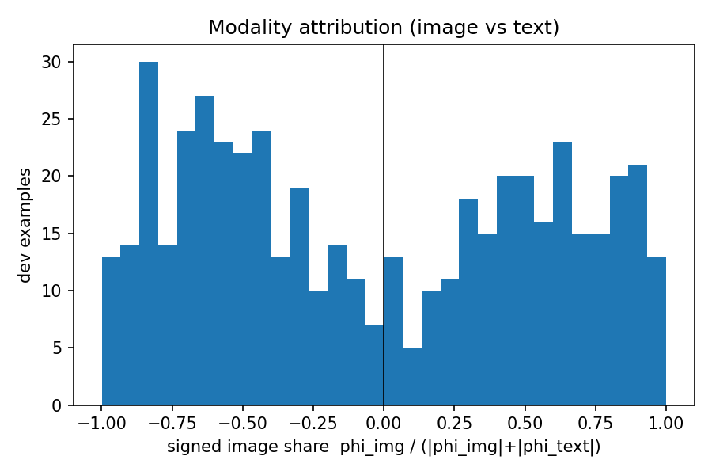

# 03 — Modality attribution for fused image+text classification

**Question.** When a fused image+text classifier calls a meme hateful or benign, how much
of the signal came from the image modality and how much from the text modality?

**Answer.** _(populated from the reproduced run; see `metrics.json`)_

**Why it matters.** Multimodal classifiers blend image and text features in ways that are
not easily inspected from the model's output alone. A modality-level attribution gives a
principled first cut at where the decision came from — useful for auditing, for identifying
failure modes (e.g., text-driven misclassifications that a better image encoder might
catch), and for understanding how much a model exploits visual vs. linguistic cues when
the two conflict.

<!--  -->

## Method

**Backbone.** Frozen **CLIP-ViT-L/14** (headline) encodes each meme image and caption
text into 1024-dimensional embeddings. The Space uses CLIP-ViT-B/32 (CPU latency budget;
see licence note below). Neither backbone is fine-tuned; the training signal is confined
to the LightGBM head.

**Classifier.** A LightGBM head trains on the concatenated `[img_emb | txt_emb]` vector
(fused), plus separate image-only and text-only unimodal heads trained on the same
backbone outputs. Class imbalance is handled via `scale_pos_weight` set from the train
label ratio (~1.79 benign-to-hateful). All hyperparameters are fixed by train-only 5-fold
cross-validation; **dev is never used for selection**.

**Attribution.** A **2-player interventional modality Shapley game** over the raw margin
(log-odds of the hateful class). The two players are the image embedding and the text
embedding; the exact Shapley formula requires four coalition evaluations per example.
Absent modalities are replaced by draws from an empirical train background (N = 200,
seeded), averaged over all background rows in a single vectorised call. Results are
reported on **dev** (500 examples, balanced 250 hateful / 250 benign). See
[ADR 003](../../docs/decisions/003-hateful-memes-licence-and-modality-shapley.md) for
the full decision rationale.

**Headline metric.** AUROC / AUPRC / accuracy on dev, with bootstrap 95% CIs (2 000
resamples), for fused + image-only + text-only heads. Per-example modality attribution:
signed image share `s = φ_image / (|φ_image| + |φ_text| + ε)`.

## Licence-safe Space note

The HuggingFace Space loads the **CLIP-ViT-B/32** encoder and the **LightGBM B/32 head
from the user's HF Model Hub** (via `hf_hub_download`). Its interventional baseline is a
**generic, non-Hateful-Memes background** (~50 CC0 / public-domain images with generic
captions, pre-encoded to `apps/hatefulmemes-space/generic_background.npz`). No HM-derived
artifact is committed or hosted anywhere.

**The Space is illustrative and not numerically comparable to the L/14 headline in
`REPORT.md`**: the backbone (B/32 vs. L/14) and the background (generic vs. empirical HM
train) both differ. The demo shows the shape of the attribution, not the headline numbers.

## Reproduce

The dataset is gated (Meta HM Agreement) and code-only — `just data` documents the
access steps and verifies/extracts the local archive; it does not download. Obtain the
dataset at `DATA_PATH` (default `~/.cache/hateful_memes`) first.

```bash
just data             # verify dataset; print access instructions if absent
just encode           # frozen CLIP-L/14 → outputs/embeddings/clip_l14/
just train            # LightGBM fused + unimodal heads → outputs/models/clip_l14/
just eval             # AUROC/AUPRC/acc + bootstrap CIs → metrics.json
just attribute        # 2-player modality Shapley on dev → metrics.json + assets/
```

To build the B/32 Space artifacts and upload the head to HF Model Hub:

```bash
just export-space-artifacts
```

This runs the B/32 encode → train → head pipeline and uploads the head; it does not copy
any HM-derived embeddings into the repository.

## Limitations

- Frozen backbone: no CLIP fine-tuning; the image and text representations are fixed at
  what CLIP learned from its own pre-training corpus.
- Modality-level granularity: attribution stops at the modality. No image-region or
  token-level attribution is computed (a qualitative token-occlusion sketch appears in
  the notebook).
- The Space uses B/32 on CPU and a generic background; its attributions are illustrative
  and do not reproduce the L/14 headline.
- Interventional / factorised background pairs are off-manifold for the fused tree model
  (a real image embedding is paired with a text embedding from a different example).
  This is inherent to marginal Shapley on trees; the mean-baseline ablation quantifies
  the practical effect.
- The empirical background carries the train class prior (~64% benign); `v(∅)` and
  absolute φ magnitudes are prior-dependent. The signed image share `s` is the robust
  summary; the balanced-background ablation quantifies the shift.
- Probability calibration is not guaranteed for the unimodal heads. The margin/Shapley
  results are unaffected, but displayed probabilities are indicative.
- Dev is the only labelled evaluation split here (500, balanced). `test.jsonl` is
  unlabelled.
- Single dataset, single backbone family, single classifier. No generalisation claim.
