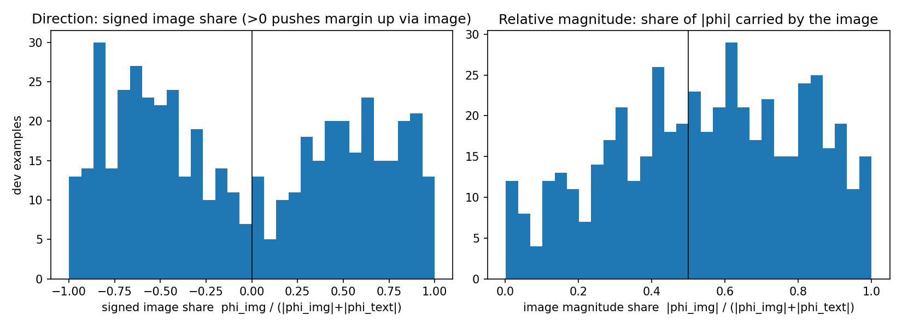

# 03 — Modality attribution for fused image+text classification

**Question.** When a fused image+text classifier calls a meme hateful or benign, how much
of the signal came from the image modality and how much from the text modality?

**Answer.** **On average, the image carries the larger absolute margin contribution.**
On dev (500, balanced), a frozen CLIP-ViT-L/14 + LightGBM head reaches **AUROC 0.711**
fused vs **0.692 image-only** and **0.575 text-only** — text alone is barely above
chance. The paired AUROC differences (paired bootstrap over shared example indices,
2 000 resamples, seed 0) are **fused − image = +0.019 [−0.013, +0.054]** — the CI
includes 0, so fusion's edge over the image head is *not* established at n = 500 — and
**fused − text = +0.136 [+0.095, +0.177]**, whose CI excludes 0. (Marginal CI overlap is
not used as a test.) The 2-player interventional modality Shapley agrees in magnitude:
mean|φ| is **image 0.84 vs text 0.68** (mean per-example magnitude share **0.55**;
aggregate magnitude share of the mean absolutes **0.56 / 0.44**). The mean *signed*
image share is near zero (−0.034): its sign measures the direction the image pushes the
margin, not dominance; the mean signed contributions are −0.11 (image) and −0.20
(text). The interaction contrast is mildly **sub-additive**: mean I = **−0.09**
[−0.13, −0.05] — non-additivity of the margin under the intervention game, nothing
more. See [`metrics.json`](metrics.json) and the
[figures](assets/modality_attribution.png); full run provenance (dataset identity,
model revision, hashes) lives in `outputs/manifest.json` locally and is summarised in
[REPAIR_REPORT.md](REPAIR_REPORT.md).

**Why it matters.** Multimodal classifiers blend image and text features in ways that are
not easily inspected from the model's output alone. A modality-level attribution gives a
principled first cut at where the decision came from — useful for auditing, for identifying
failure modes (e.g., text-driven misclassifications that a better image encoder might
catch), and for understanding how much a model exploits visual vs. linguistic cues when
the two conflict.

<!--  -->

## Method

**Backbone.** Frozen **CLIP-ViT-L/14** (headline) encodes each meme image and caption
text into 1024-dimensional embeddings. The Space uses CLIP-ViT-B/32 (CPU latency budget;
see licence note below). Neither backbone is fine-tuned; the training signal is confined
to the LightGBM head.

**Classifier.** A LightGBM head trains on the concatenated `[img_emb | txt_emb]` vector
(fused), plus separate image-only and text-only unimodal heads trained on the same
backbone outputs. Class imbalance is handled via `scale_pos_weight` set from the train
label ratio (~1.79 benign-to-hateful). Hyperparameters are **fixed in
`configs/train.yaml`** (400 trees, lr 0.05, 31 leaves); no cross-validation was run.
Dev is never used for selection; it is the evaluation split only.

**Attribution.** A **2-player interventional modality Shapley game** over the raw margin
(log-odds of the hateful class). The two players are the image embedding and the text
embedding; the exact Shapley formula requires four coalition evaluations per example.
Absent modalities are replaced by draws from an empirical train background (N = 200,
seeded), averaged over all background rows in a single vectorised call. Results are
reported on **dev** (500 examples, balanced 250 hateful / 250 benign). See
[ADR 003](../../docs/decisions/003-hateful-memes-licence-and-modality-shapley.md) for
the full decision rationale.

**Headline metric.** AUROC / AUPRC / accuracy on dev, with bootstrap 95% CIs (2 000
resamples), for fused + image-only + text-only heads. Per-example modality attribution,
with sign and magnitude reported separately:

- **signed image share** `s = φ_image / (|φ_image| + |φ_text|)` — in [−1, 1]; the *sign*
  says whether the image's contribution pushes the margin up (+) or down (−). It does
  **not** say which modality dominates (a large negative φ_image dominates the text in
  magnitude while giving `s < 0`). Defined as 0 when both contributions are ~0.
- **image magnitude share** `m = |φ_image| / (|φ_image| + |φ_text|)` — in [0, 1]; the
  share of the total absolute contribution carried by the image. Defined as 0.5 when
  both contributions are ~0.
- **interaction** `I = v({img,txt}) − v({img}) − v({txt}) + v(∅)` — non-additivity of
  the margin under the interventional game. Narrowly interpreted; it is not evidence of
  semantic synergy or causal interplay.

## Licence-safe Space note

The HuggingFace Space loads the **CLIP-ViT-B/32** encoder and the **LightGBM B/32 head
from the user's HF Model Hub** (via `hf_hub_download`). Its interventional baseline is a
**generic, non-Hateful-Memes background** (~50 random-noise images with generic
captions, pre-encoded to `apps/hatefulmemes-space/generic_background.npz`). No HM-derived
artifact is committed or hosted anywhere.

**The Space is illustrative and not numerically comparable to the L/14 headline in
`REPORT.md`**: the backbone (B/32 vs. L/14) and the background (generic vs. empirical HM
train) both differ. The demo shows the shape of the attribution, not the headline numbers.

## Reproduce

The dataset is gated (Meta HM Agreement) and code-only — `just data` documents the
access steps and verifies/extracts the local archive; it does not download. Obtain the
dataset at `DATA_PATH` (default `~/.cache/hateful_memes`) first.

```bash
just data             # verify dataset; print access instructions if absent
just encode           # frozen CLIP-L/14 → outputs/embeddings/clip_l14/
just train            # LightGBM fused + unimodal heads → outputs/models/clip_l14/
just eval             # AUROC/AUPRC/acc + bootstrap CIs + paired AUROC diffs → metrics.json
just attribute        # 2-player modality Shapley on dev → metrics.json + assets/
```

To build the B/32 Space artifacts and upload the head to HF Model Hub:

```bash
just export-space-artifacts
```

This runs the B/32 encode → train → head pipeline and uploads the head; it does not copy
any HM-derived embeddings into the repository.

## Limitations

- Frozen backbone: no CLIP fine-tuning; the image and text representations are fixed at
  what CLIP learned from its own pre-training corpus.
- Modality-level granularity: attribution stops at the modality. No image-region or
  token-level attribution is computed (a qualitative token-occlusion sketch appears in
  the notebook).
- The Space uses B/32 on CPU and a generic background; its attributions are illustrative
  and do not reproduce the L/14 headline.
- Interventional / factorised background pairs are off-manifold for the fused tree model
  (a real image embedding is paired with a text embedding from a different example).
  This is inherent to marginal Shapley on trees.
- The empirical background carries the train class prior (~64% benign); `v(∅)` and
  absolute φ magnitudes are prior-dependent. The magnitude share `m` and the signed share
  `s` normalise per-example magnitudes. Mean-baseline and balanced-background sensitivity
  analyses are specified in ADR 003 but **have not been run** — they are future work.
- Probability calibration is not guaranteed for the unimodal heads. The margin/Shapley
  results are unaffected, but displayed probabilities are indicative.
- Dev is the only labelled evaluation split here (500, balanced). `test.jsonl` is
  unlabelled.
- All headline numbers above come from the 2026-09-22 reproduction rerun (run id
  `20260922-025212Z`), which re-derived the original run's aggregates bit-identically
  (per-head AUROC/AUPRC/accuracy match the 2024–26 committed values) and additionally
  produced the paired CIs, signed/magnitude-share summaries and interaction values.
  Run artifacts (embeddings, boosters, per-example rows) are retained under
  `outputs/` with hashes in `outputs/manifest.json`.
- Single dataset, single backbone family, single classifier. No generalisation claim.
