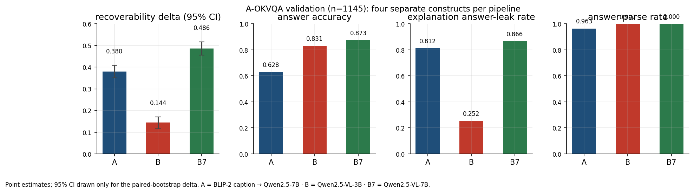

# 04 -- Do caption-then-LLM explanations actually describe the image?

## 1. Research question

When a caption-then-LLM pipeline answers a visual question, the LLM explains a *caption*,
not an *image*. How much does each pipeline's answer depend on the image vs. on its own
explanation? How often does the caption pipeline diverge from a direct vision-language
model -- and how often does the generated explanation simply restate the answer?

## 2. 30-second answer

On the full A-OKVQA validation split (n=1145), the direct VLMs answer more accurately
(B7 0.87, B 0.83) than the caption-then-LLM pipeline (A 0.63). When visual input is
removed, supplying each model's own explanation makes its original answer substantially
more recoverable (Delta = with-explanation minus no-explanation consistency: B7 +0.49,
A +0.38, B +0.14, all CIs clear of zero). The pipelines with the largest deltas are also
the ones whose explanations most often restate the answer verbatim (B7 0.87, A 0.81,
B 0.25 leak rate) -- a trivial recovery channel this probe cannot fully separate from
genuinely explanatory content.

## 3. Hero result

| Pipeline | Accuracy | Recoverability Delta (95% CI) | Expl leak rate |
|---|---|---|---|
| A -- BLIP-2 caption → Qwen2.5-7B | 0.628 | **0.380** [0.351, 0.409] | 0.812 |
| B -- Qwen2.5-VL-3B | 0.831 | **0.144** [0.115, 0.170] | 0.252 |
| B7 -- Qwen2.5-VL-7B | 0.873 | **0.486** [0.456, 0.516] | 0.866 |



The four figure panels are **separate constructs**: recoverability delta, answer accuracy,
explanation leak rate, parse rate. Read them independently; none is a measure of the
others. Point estimates are shown as such; 95% CIs exist only for the paired-bootstrap
delta. Full results and caveats: [REPORT.md](REPORT.md).

## 4. Why it matters

VQA explanations are only useful if they track what the model actually used. The probe
shows that once the image is removed, the model's own explanation is often enough to
reproduce its answer -- most of all for the strongest model. That is a recoverability red
flag, not proof of unfaithfulness: a faithful explanation may legitimately encode visual
evidence in text, and part of the recovery is the trivial answer-restating channel.

## 5. Experimental design

- **Dataset.** A-OKVQA (Schwenk et al. 2022) `validation` split, n=1145, labelled,
  four-choice with three human rationales per item. Images are never committed.
- **Pipeline A** (`Salesforce/blip2-opt-2.7b` → `Qwen/Qwen2.5-7B-Instruct`): captions the
  image; the LLM answers from `(question, caption, choices)`.
- **Pipeline B** (`Qwen/Qwen2.5-VL-3B-Instruct`) and **B7** (`Qwen/Qwen2.5-VL-7B-Instruct`):
  direct VLMs answering from `(question, image, choices)`. B7 bounds the parameter-count
  confound in the A-vs-B comparison.
- **Probe.** Visual evidence removed per pipeline (null caption for A; black tile for B/B7);
  each re-answers twice -- with and without its own prior explanation. Headline:
  `Delta = consistency(with-expl) - consistency(no-expl)`, paired-bootstrap 95% CI
  (2,000 resamples, seed 0).
- **Leakage measures.** Dataset-side: items whose human rationales restate the gold answer
  text (805/1145) are filtered in a sensitivity split (n=340). Model-side: the fraction of
  explanations that contain the chosen answer text verbatim.
- **Determinism.** Zero-shot, greedy decoding (`do_sample=False`, `max_new_tokens=256`,
  fp16, one model resident at a time), model revisions logged at run time.

## 6. Controls / baselines

- **Paired no-explanation baseline** under identical null visual input -- the Delta
  denominator. It sits near 0.50 for all pipelines; that is an empirical prior-driven rate,
  not a chance level (uniform guessing would give ~0.25, but the outputs are not uniform
  random).
- **Size-matched VLM arm (B7)** to bound the parameter-count confound.
- **Leakage-free subset** to check that dataset-side answer leakage is not driving the
  result (it is not).
- **Explanation leak rate** to expose the trivial restating-the-answer channel.

## 7. Results

See [REPORT.md](REPORT.md) §5 for the full tables: accuracy/parse/leak (§5.1), the probe
(§5.2), inter-pipeline divergence (§5.3), and the leakage-free subset (§5.4). The
notebook [01-vqa-consistency](notebooks/01-vqa-consistency.ipynb) reproduces every
headline number from the run.

## 8. What the result supports

- Supplying each pipeline's own explanation increases answer recovery under null visual
  input; the size-matched VLMs answer more accurately than the caption pipeline under
  this setup.
- Explanation leakage correlates with the recoverability delta across the three
  pipelines (descriptive, not causal).
- A diverges from both direct-VLM variants much more often than B and B7 diverge from
  each other (~37% vs ~14%) -- consistent with the architecture/modality-stack difference
  contributing substantially, though this design does not isolate it from model-family
  differences.

## 9. What it does NOT support

The delta is **incremental answer recoverability from the supplied explanation under null visual input** -- nothing more. It does **not** show:

- that the original answer was unfaithful to the image;
- that the original model used text rather than the image;
- hidden reasoning or causal faithfulness of the explanation;
- that larger capacity generally makes explanations less faithful (B7 > B here is one
  descriptive datapoint, not a controlled capacity effect);
- anything about human-rationale similarity/plausibility (not measured here).

A small Delta is also ambiguous (uninformative explanation, ignored explanation, or an
already-high baseline can all produce it).

## 10. Reproduce

```bash
export P4_PROJECT_ROOT=$PWD/projects/04-vqa-aokvqa
uv sync --extra vqa          # one-time; installs the vqa optional-dependency group

# 1. Prepare data (decode images, build leakage flag, write parquet)
uv run python projects/04-vqa-aokvqa/scripts/00_data.py

# 2. Run pipelines A, B, B7 (one model resident at a time; expect 4-8 h on RTX 3090)
uv run python projects/04-vqa-aokvqa/scripts/10_run_pipelines.py

# 3. Run the two-arm ablation probe (with-expl and no-expl)
uv run python projects/04-vqa-aokvqa/scripts/20_probe.py

# 4. Compute metrics, CIs, and render the four-panel hero figure
uv run python projects/04-vqa-aokvqa/scripts/30_eval.py
```

To re-render the hero figure from the committed aggregate snapshot (no models, no data):

```bash
uv run python projects/04-vqa-aokvqa/scripts/30_eval.py --from-snapshot
```

## 11. Limitations

Zero-shot only; A-vs-B confounded by model family and modality stack; BLIP-2 caption
quality is a confound for A; the probe is one family, not a battery; the null-caption and
black-tile ablations are not strictly comparable; multiple-choice only; strict-then-text
parsing; the leakage-free subset is selected, not random, and removes neither paraphrase
leakage nor generated-explanation leakage; `outputs/metrics.json` from the real run was
not committed (headline values survive in the executed notebook; see REPORT §8). Full
list: [REPORT.md](REPORT.md) §7.

## 12. Further reading

- [REPORT.md](REPORT.md) -- full results, interpretation, provenance.
- [ADR 004](../../docs/decisions/004-vqa-pipelines-and-vision-ablation.md) -- the five
  design decisions behind the probe (read together with the corrected estimand language
  in REPORT §1.1).
- [Spec v2.1](../../docs/superpowers/specs/2026-05-26-vqa-aokvqa-design.md).
- **Later related work:** a separate MSc thesis by the same author conducts a stronger
  behavioural-faithfulness study. This project is not part of that thesis and imports none
  of its results.
