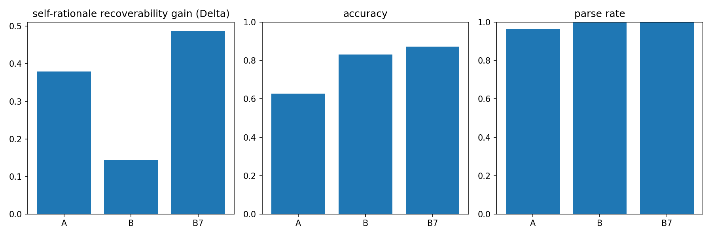

# Project 4 -- Vision-ablation probe for caption-then-LLM vs. direct VLM on A-OKVQA

**Author:** Desmond Mariita.
**Dataset:** A-OKVQA (Schwenk et al. 2022; open; code-only, images not committed).
**Status:** scaffold -- results pending the real run (Task 18).

---

## 1. Question and framing

When a caption-then-LLM pipeline answers a visual question, the LLM's explanation
describes a caption -- not an image. Two questions motivate this project:

(a) How often does the caption-then-LLM pipeline's answer **diverge** from a direct
vision-language model on the same question?

(b) How much does each pipeline's answer actually **depend on the image** vs. on its own
explanation?

The second question is measured by a **vision-ablation probe with a paired baseline**: for
each pipeline we remove the visual evidence and re-answer twice -- once with the model's
own prior explanation and once without -- and report the **consistency gain from the
explanation**:

```
Delta = consistency(with-explanation) - consistency(no-explanation)
```

### How Delta is read

- **Delta > 0 (positive):** the explanation, not the image, is what lets the model
  reproduce its answer -- a self-rationale recoverability red flag. The model is recovering
  its original choice from its own explanation rather than from visual evidence.
- **Delta near 0:** the explanation adds nothing the question alone did not already supply.
  Answers are likely driven by language priors or the question text, not recovered from the
  rationale. The visual ablation has little incremental effect when the explanation is present.
- **Delta < 0 (negative):** the explanation actively hurts recovery relative to the
  no-explanation baseline. Treated as noise around zero; reported with its CI, not
  over-interpreted.

The raw with-explanation rate is also reported, **honestly labelled "self-rationale
recoverability"** to signal that it conflates image-independence with explanation-copying
on its own. See [ADR 004](../../docs/decisions/004-vqa-pipelines-and-vision-ablation.md)
for the full design rationale.

## 2. Data

**Corpus.** A-OKVQA (Schwenk et al. 2022). Multiple-choice VQA requiring outside knowledge,
built over COCO images. Source: `HuggingFaceM4/A-OKVQA` on HuggingFace, which bundles the
COCO image as a PIL object per item.

**Headline split.** `validation` (~1.1k items, labelled). The full validation split is the
only configuration that may be reported as the headline; no sub-sampling is performed.

**Fields per item.** `question`, `choices` (4), `correct_choice_idx`, `rationales` (3),
`image`.

**Leakage sensitivity split.** Items where any human rationale contains the gold choice
text (normalised; choice text matched, not bare letter -- bare letters cause false
positives) are flagged `leakage_flag=True`. All metrics are reported on both the unfiltered
set and the filtered (leakage-free) subset.

**Governance.** A-OKVQA is open but images are not committed. `outputs/` is gitignored.
Only code, configs, `assets/hero.png`, the notebook (with outputs, no raw dataset dumps),
and this `REPORT.md` are committed.

## 3. Pipelines

All pipelines are zero-shot (no fine-tuning). Generation is deterministic (`do_sample=False`,
`max_new_tokens=256`, `torch_dtype=fp16`, `device_map="cuda:0"`).

**Pipeline A -- caption-then-LLM.**
`Salesforce/blip2-opt-2.7b` (fp16) captions the image; `Qwen/Qwen2.5-7B-Instruct` (fp16)
receives `(question, caption, choices)` and produces an answer and one-sentence explanation.
The LLM never sees the image directly.

**Pipeline B -- direct VLM.**
`Qwen/Qwen2.5-VL-3B-Instruct` (fp16) receives `(question, image, choices)` and produces
an answer and one-sentence explanation.

**Pipeline B7 -- size-matched VLM arm (required for the headline).**
`Qwen/Qwen2.5-VL-7B-Instruct` (fp16) runs the same direct-VLM protocol as Pipeline B.
B7 is required to bound the parameter-count confound in the A-vs-B comparison: Pipeline A
uses a ~7B LLM while Pipeline B uses a ~3B VLM; without B7, the size gap is unmitigated.
If B7 cannot complete, this fact is recorded in `metrics.json` as `"b7_completed": false`
and the size confound is reported as unmitigated below (never silently dropped).

**Model revisions.** Each model's HuggingFace commit hash is logged in `metrics.json` at
run time to ensure reproducibility.

## 4. Metric definitions

All metric code lives in `src/awake/eval/vqa_consistency.py` (pure, unit-tested). Bootstrap
95% CIs use `awake.eval.bootstrap` (2,000 resamples, percentile method, fixed seed).

**Accuracy.** Top-1 accuracy on the original (non-ablated) answers. Unparseable outputs
(`None`) count as wrong. Denominator = all items.

**Parse rate.** Fraction of items where the model output was successfully parsed to a
choice index. Reported separately for the answer arm and each ablated arm
(`parse_rate.{answer, abl_expl, abl_noexpl}`).

**Self-rationale recoverability.** `P(ablated answer == original answer)` when the
with-explanation arm is used. Honest label: this rate alone conflates image-independence
with explanation-copying. Denominator = all items (None on either side = inconsistent).

**Consistency (no-explanation baseline).** `P(ablated answer == original answer)` when
only `(question, null-visual, choices)` is used -- no prior explanation. This is the
baseline that makes Delta interpretable.

**Delta.** Consistency(with-explanation) - Consistency(no-explanation). With paired
bootstrap 95% CI.

**Model-output leakage rate.** Fraction of items where the model's own explanation
contains the chosen choice's text verbatim (normalised). High leakage rate means the
explanation is essentially restating the answer, which inflates self-rationale recoverability.

**Inter-pipeline divergence.** Rate at which two pipelines produce different answers
(None on either side counts as disagreement). Reported per pair with a 95% CI and a
2x2 correctness-conditioned contingency: `both_correct`, `a_correct_b_wrong`,
`a_wrong_b_correct`, `both_wrong`, each with `agree` and `disagree` counts.

## 5. Results

Hero figure (`assets/hero.png`): three-panel summary -- (i) Delta per pipeline (with 0
reference line), (ii) accuracy, (iii) parse rate.



### 5.1 Headline metrics (validation, full split)

All numbers below are placeholders. Run `uv run python projects/04-vqa-aokvqa/scripts/30_eval.py`
to populate `outputs/metrics.json`, then replace these cells with the real values.

| Pipeline | Accuracy (95% CI) | Parse rate | Expl leak rate |
|---|---|---|---|
| A (BLIP-2 + Qwen-7B) | (filled by the real run) | (filled by the real run) | (filled by the real run) |
| B (Qwen-VL-3B) | (filled by the real run) | (filled by the real run) | (filled by the real run) |
| B7 (Qwen-VL-7B) | (filled by the real run) | (filled by the real run) | (filled by the real run) |

### 5.2 Vision-ablation probe (Delta per pipeline)

| Pipeline | Self-rationale recov. (with-expl) | Consistency (no-expl baseline) | Delta (95% CI) |
|---|---|---|---|
| A (BLIP-2 + Qwen-7B) | (filled by the real run) | (filled by the real run) | (filled by the real run) |
| B (Qwen-VL-3B) | (filled by the real run) | (filled by the real run) | (filled by the real run) |
| B7 (Qwen-VL-7B) | (filled by the real run) | (filled by the real run) | (filled by the real run) |

### 5.3 Inter-pipeline divergence

| Pair | Divergence (95% CI) | both_correct agree/disagree | both_wrong agree/disagree |
|---|---|---|---|
| A vs B | (filled by the real run) | (filled by the real run) | (filled by the real run) |
| A vs B7 | (filled by the real run) | (filled by the real run) | (filled by the real run) |
| B vs B7 | (filled by the real run) | (filled by the real run) | (filled by the real run) |

### 5.4 Filtered subset (leakage-free)

| Pipeline | Accuracy | Delta (95% CI) |
|---|---|---|
| A | (filled by the real run) | (filled by the real run) |
| B | (filled by the real run) | (filled by the real run) |
| B7 | (filled by the real run) | (filled by the real run) |

### 5.5 B7 completion status

`b7_completed:` (filled by the real run -- see `metrics.json`). If `false`, the size
confound between A (~7B parameters) and B (3B parameters) is unmitigated and the A-vs-B
comparison is limited to the A-vs-B7 pair.

## 6. Discussion

_To be filled after the real run (Task 18). The framing below describes what the results
will show._

The Delta metric disambiguates two failure modes that raw consistency cannot separate: a
pipeline that copies its explanation and a pipeline that genuinely relies on the image. A
high self-rationale recoverability rate paired with Delta near zero means language priors
are driving the answer; a high rate paired with Delta > 0 means the explanation is the
primary cue and the image carries little additional weight.

The correctness-conditioned divergence contingency reveals whether A and B tend to fail
on the same items (`both_wrong` agree) or on different items -- the latter would suggest
the pipelines fail for different reasons and might be informative for ensembling.

The B-vs-B7 divergence pair bounds how much of the A-vs-B divergence is attributable to
model capacity alone.

## 7. Limitations

**Zero-shot only.** No fine-tuning of either pipeline. Results are specific to the
zero-shot regime; fine-tuned models may show qualitatively different Delta patterns.

**A-vs-B confounded by parameter count, model family, and modality stack.** Pipeline A
uses a ~7B LLM (after a ~2.7B captioner) while Pipeline B uses a ~3B VLM. The B7 arm
bounds the parameter-count confound but does not remove it entirely; the model-family
(BLIP-2+Qwen vs Qwen-VL) and modality-stack (caption pipeline vs. direct VLM) confounds
remain uncontrolled. The headline claim is scoped to these specific instantiations.

**BLIP-2 caption quality is a confound for Pipeline A.** If BLIP-2 produces a misleading
or low-quality caption, Pipeline A's accuracy and divergence reflect that, not the LLM's
visual reasoning. Results are scoped to the BLIP-2 instantiation.

**Probe is one family, not a battery.** The paired-baseline ablation probe is one design
in a broad space of faithfulness evaluations. It cannot distinguish all causal pathways
between image evidence, explanation, and answer. A full faithfulness battery (e.g.,
counterfactual image swaps, attention analysis, causal tracing) would be needed for a
comprehensive picture.

**Pipeline A ablation asymmetry.** Pipeline A replaces the caption with a null string while
Pipeline B replaces the image with a black tile. These are the natural ablations for each
architecture but they are not strictly comparable: the null string is a lexical intervention
while the black tile is a visual intervention.

**Multiple-choice only.** A-OKVQA direct-answer splits are not scored; all results are
restricted to the four-choice multiple-choice format.

**Answer parsing is strict-then-heuristic.** The strict parser (first-line `Answer: <A-D>`)
is the primary; a text-substring fallback handles non-strict-compliant outputs. Unparseable
outputs count as wrong/inconsistent. Parse rate is reported per arm to make failures visible.

**Prompt sensitivity bounded by one alternate-wording arm.** A single alternative prompt
wording is run as a sensitivity check. This is not exhaustive; different prompt formulations
could shift absolute accuracy and consistency rates.

**Subset N.** If the run used a subset (pilot mode), it is recorded as such in
`metrics.json` and is NOT the headline. The headline requires the full validation split.

## 8. References

- Schwenk, D., Khandelwal, A., Clark, C., Marino, K., & Mottaghi, R. (2022).
  *A-OKVQA: A benchmark for visual question answering using world knowledge.*
  ECCV 2022.
- Salesforce Research. (2023). *BLIP-2: Bootstrapping language-image pre-training with
  frozen image encoders and large language models.*
- Qwen Team. (2024). *Qwen2.5-VL technical report.*
- Qwen Team. (2024). *Qwen2.5 technical report.*
