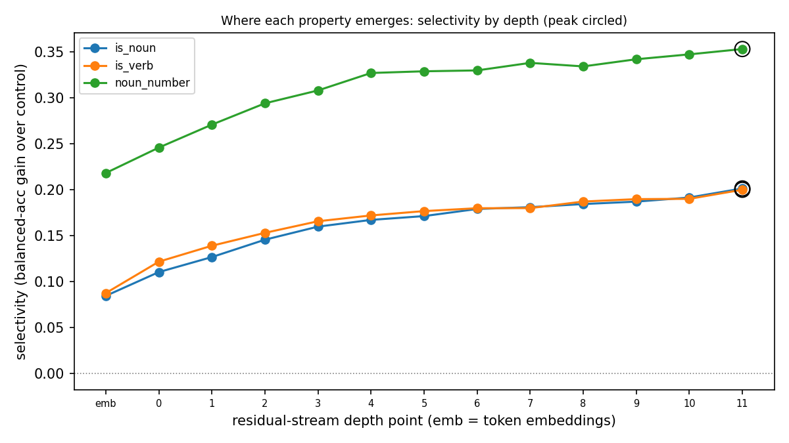

# 05 -- At which layer does a property become linearly decodable from Pythia-160M?

**Question.** At which layer of a small open transformer does a given binary linguistic
property become linearly decodable from the residual stream -- beyond what a probe can
recover from word identity alone?

**Why it matters.** Per-layer linear probing is the standard first step in mechanistic
interpretability, and a small open model is the right place to demonstrate the method
end-to-end with a proper control task baseline (Hewitt & Liang 2019).

<!--  -->

## Method

**Model.** Pythia-160M (EleutherAI; GPT-NeoX; 12 blocks, d_model=768). Loaded frozen;
residual-stream activations extracted at 13 depth points via forward hooks (not the HF
`hidden_states` tuple, which mislabels GPT-NeoX).

**Data.** UD English-EWT (Silveira et al. 2014), CC BY-SA 4.0. Three binary properties:
`is_noun` (common noun vs. all others), `is_verb`, `noun_number` (plural vs. singular
among nouns). Word-to-token alignment uses a full-sentence offset-overlap test (required
for byte-level BPE).

**Probes and control tasks.** Per-layer `LogisticRegression(class_weight="balanced")` with
per-layer StandardScaler. Each probe is paired with a Hewitt & Liang control task (random
per-type labels, token-rate-matched, K=5 seeds). Primary metric: **balanced accuracy**
(chance = 0.5 regardless of class imbalance). Headline: **selectivity = balanced_accuracy
(probe) - balanced_accuracy(control)** by depth, with paired sentence-cluster bootstrap
95% CIs.

**Emergence.** Peak = argmax selectivity over the 13-point depth axis. Earliest emergence =
earliest depth point whose selectivity CI overlaps the peak's CI.

**Selectivity is necessary, not sufficient.** Positive selectivity shows the property is
more linearly recoverable than an arbitrary word-type code; it does not show causal use.

## How to reproduce

```bash
export P5_PROJECT_ROOT=$PWD/projects/05-mechanistic-pythia

# Step 1: fetch + verify UD English-EWT -> outputs/prepared/
export PATH="$HOME/.local/bin:$PATH" && uv run python projects/05-mechanistic-pythia/scripts/00_data.py

# Step 2: hook-based activation extraction -> outputs/acts/
uv run python projects/05-mechanistic-pythia/scripts/10_extract.py

# Step 3: per-layer probing + control tasks -> outputs/probe/
uv run python projects/05-mechanistic-pythia/scripts/20_probe.py

# Step 4: metrics.json + figures -> outputs/ + assets/
uv run python projects/05-mechanistic-pythia/scripts/30_eval.py

# Optional: execute the notebook
uv run --extra dev jupytext --to notebook --execute \
    projects/05-mechanistic-pythia/notebooks/01-layerwise-probing.py
```

Run the test suite (no model download):

```bash
export PATH="$HOME/.local/bin:$PATH"
uv run pytest projects/05-mechanistic-pythia -m "unit or smoke" --no-cov -v
```

## Outputs

- `outputs/metrics.json` -- per-(property, layer) balanced accuracy, control accuracy,
  selectivity, cluster-bootstrap 95% CIs, emergence summary (gitignored).
- `assets/probe_is_noun.png`, `assets/probe_is_verb.png`, `assets/probe_noun_number.png`
  -- per-property depth plots.
- `assets/hero.png` -- three-property selectivity-by-depth overlay.
- `notebooks/01-layerwise-probing.py` -- jupytext notebook (executed with outputs
  after Task 15).

## Further reading

- Results and discussion: [REPORT.md](REPORT.md)
- Design decisions: [ADR 005](../../docs/decisions/005-probing-pythia-and-control-tasks.md)

## Scope (v1.0)

Probing only. **Deferred to v1.1:** activation patching on GPT-2-small (where the IOI
literature is native; Wang et al. 2022), and pretrained-SAE feature inspection via
`sae-lens` (GPT-2-small residual SAEs across all layers are available, per the `sae-lens`
registry).

## Limitations

- Probing tells us what is linearly decodable; it does not show what the model uses.
- Selectivity is necessary-not-sufficient: confounds include lexical identity, suffix
  orthography (especially `noun_number` at layer 0), token frequency, position, and
  type-cluster structure.
- Three properties are a sample, not a survey.
- One model, one size (Pythia-160M), one domain (UD-EWT English web text): no scaling
  claim and no cross-domain generalisation.
