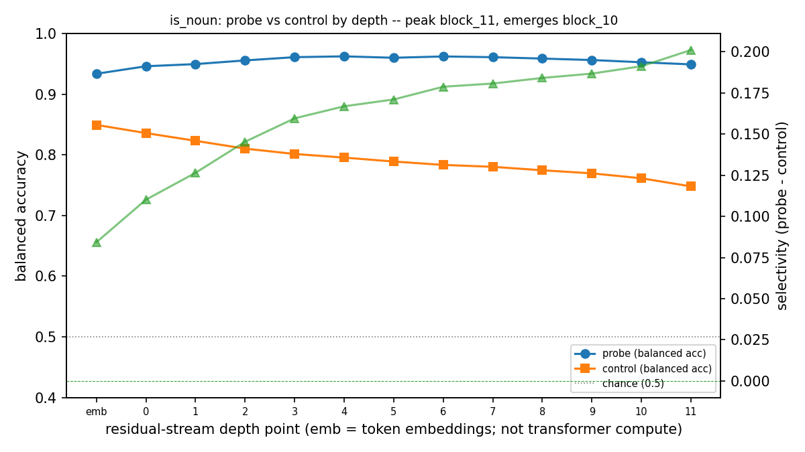
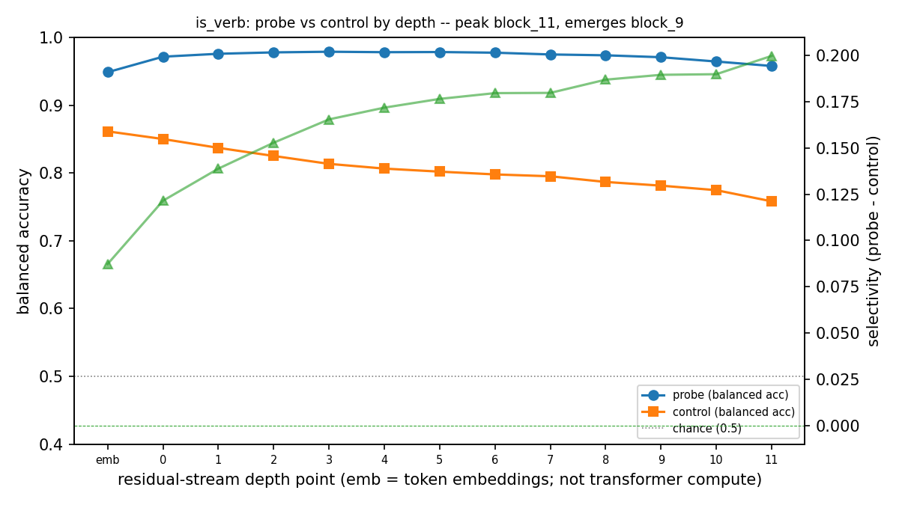
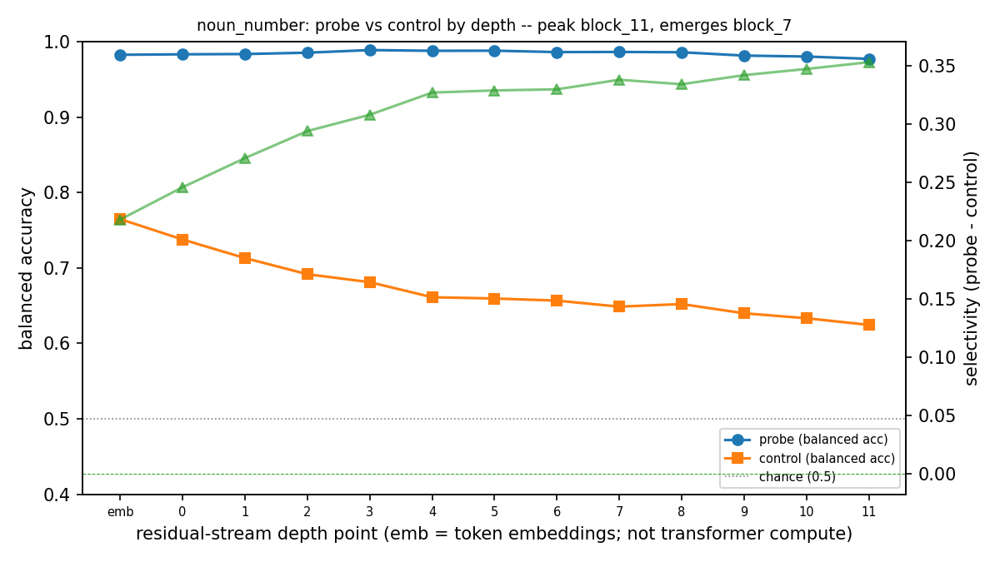

# Project 5 -- At which layer does a property become linearly decodable from Pythia-160M?

**Author:** Desmond Mariita.
**Dataset:** UD English-EWT (Silveira et al. 2014; CC BY-SA 4.0; code-only, `.conllu` not committed).
**Status:** complete -- real run on the full UD English-EWT validation split (Pythia-160M,
revision `50f5173d`), generated 2026-05-27. Every result number is read from
`outputs/metrics.json` (no fabrication); `.conllu`/`outputs/` are gitignored.

---

## 1. Question and framing

**At which layer of a small open transformer does a given binary linguistic property become
linearly decodable from the residual stream -- beyond what a probe can recover from word
identity alone?**

We answer with **per-layer linear probes** on **Pythia-160M** (EleutherAI; GPT-NeoX
architecture; 12 blocks; `d_model` = 768), each paired with a **Hewitt & Liang (2019)
control task** (random per-type labels). The headline per (property, layer) is
**selectivity = balanced_accuracy(probe) - balanced_accuracy(control)**.

### How to read selectivity

Selectivity is **necessary, but not sufficient**, evidence of genuine encoding. A positive
selectivity shows the property is *more linearly recoverable than an arbitrary word-type
code* at that layer. It does **not** show the model uses the feature causally. Confounds
that can produce positive selectivity without genuine encoding include:

- **Lexical identity memorisation** -- the probe may simply be reading the identity of
  the word type (nouns tend to be the same words across sentences).
- **Suffix orthography** -- especially for `noun_number`: the plural morpheme `-s` is
  often the last subword of a plural noun at every depth (layer 0 = token embeddings,
  no transformer computation). High `noun_number` selectivity at shallow depths is
  expected to reflect orthography, not transformer computation.
- **Token frequency and position** -- frequent tokens and sentence-initial tokens have
  distinct residual distributions.
- **Type-cluster structure** -- Ravichander et al. (2021) bound individual-type
  memorisation but not cluster-level memorisation.

Linear decodability is a description of *linear availability by depth*, not a causal claim.
See [ADR 005](../../docs/decisions/005-probing-pythia-and-control-tasks.md) for the full
design rationale.

## 2. Data

**Corpus.** Universal Dependencies English-EWT (Silveira et al. 2014). A gold-standard
Universal Dependencies treebank over English web text, with UPOS labels and morphological
features. Source: `UniversalDependencies/UD_English-EWT`, tag `r2.14` (fetched and
SHA-256-verified by `scripts/00_data.py`).

**Licence.** CC BY-SA 4.0.

**Attribution (CC BY-SA 4.0 requirement).**
Silveira, N., Dozat, T., de Marneffe, M.-C., Bowman, S., Connor, M., Bauer, J., &
Manning, C. D. (2014). A Gold Standard Dependency Corpus for English. In Proceedings of
the Ninth International Conference on Language Resources and Evaluation (LREC-2014).
Licensed under CC BY-SA 4.0.

**Splits.** Standard UD-EWT train / dev / test splits. Approximate sizes: train ~12.5k
sentences, dev ~2k sentences, test ~2.1k sentences.

**Fields per token.** FORM (surface), UPOS, `Number=` feature from FEATS, `SpaceAfter=`
from MISC (used for surface string reconstruction).

**Governance.** The `.conllu` files and all derived `outputs/` artefacts (parquet,
activations) are gitignored and never committed. Only code, configs, `assets/` figures,
the notebook (with outputs; no UD text in notebook outputs), and this `REPORT.md` are
committed.

## 3. Method

### Model

**Pythia-160M** (`EleutherAI/pythia-160m`, GPT-NeoX architecture). 12 transformer blocks,
`d_model` = 768. Loaded frozen (`eval()`, no grad) with a pinned `revision` commit SHA
(recorded in `configs/probe.yaml` and in `metrics.json`).

### Depth axis: 13 points via forward hooks

Activations are extracted at **13 points on the depth axis** using forward hooks (not the
HF `output_hidden_states` tuple, which mislabels GPT-NeoX: index 0 = embedding input; last
= post-`final_layer_norm`). The 13 points are:

- `embedding` -- output of `model.gpt_neox.embed_in` (token + position; no transformer
  computation).
- `block_0` through `block_11` -- output of each `GPTNeoXLayer` (i.e. `resid_post` for
  that block).

An additional point **`ln_f`** (output of `model.gpt_neox.final_layer_norm`, what the
unembedding reads) is captured separately and reported as an extra point, not on the
depth axis. See ADR 005 Decision 1.

Residuals are stored float16, upcast to float64 before StandardScaler/LR.

### Properties (3 binary, token-level)

| Property | Definition | Base rate (approx; measured at run) |
|---|---|---|
| `is_noun` | `upos == "NOUN"` (common noun) | ~0.17 |
| `is_verb` | `upos == "VERB"` | ~0.11 |
| `noun_number` | Among NOUN tokens with a `Number` feature: `Plur=1`, `Sing=0` | measured at run |

`noun_number` is conditional on noun-hood being encoded. If train n falls below the
configured minimum (3,000 tokens), it is flagged as underpowered in `metrics.json`.

### Probes and control tasks

**Pre-probe standardisation.** Per-(property, point) `StandardScaler` fitted on train
residuals; applied to test. `C` chosen once per property on the dev split (grid
{0.01, 0.1, 1.0}); held constant across all points for that property (comparability
tradeoff -- reported selectivity is a conservative estimate at extreme depths).

**Probe.** `LogisticRegression(class_weight="balanced", max_iter=2000, solver="lbfgs")`,
trained on (train, stratified cap 60k tokens) and scored on the full test split.

**Control task (Hewitt & Liang 2019).** Random per-word-type binary label map, built over
the train+dev+test type union (so no test token is ever unseen). Positive token share is
matched to the property's train base rate (greedy seeded-random assignment by train token
frequency). Repeated over K=5 seeds; control balanced accuracy is averaged over seeds.

**Selectivity.** `balanced_accuracy(probe) - mean_K balanced_accuracy(control_K)` per point.

### Metrics and CIs

- **Primary:** balanced accuracy (mean of per-class recall; chance = 0.5 regardless of
  prevalence). Robust to the `is_verb` / `is_noun` class imbalance.
- **Secondary:** majority-class baseline (train-majority scored on test; logged in
  `metrics.json`). Raw accuracy and AUROC were specified as secondary context but are **not
  logged in this run** (the persisted per-token predictions are hard labels, so AUROC would
  require re-running with probabilities) -- future work.
- **CIs:** paired sentence-cluster bootstrap (2,000 resamples). Sentences are the resampling
  unit (tokens within a sentence are correlated). Probe and control are recomputed on the
  same resampled sentences (paired), giving correct variance estimates for selectivity.
- **Emergence.** Peak = argmax selectivity over the 13 depth points. Earliest emergence =
  earliest depth point whose selectivity CI overlaps the peak's CI (avoids over-reading a
  noisy argmax; `ln_f` excluded from peak search).

### Word-to-token alignment

Full sentence tokenised once with `return_offsets_mapping=True`. Each UD word's character
span is matched to subword tokens by an **overlap** test (`tok_end > ws AND tok_start < we`,
required for byte-level BPE). The **last** overlapping subword's residual is used. Dropped
words are counted in `metrics.json`.

## 4. Results

Full per-point numbers are in each table below; the per-property figures plot the complete
curves with cluster-bootstrap CI bands. Raw per-token data lives in `outputs/` (gitignored);
the committed figures + this report carry the results.

### Run metadata

| Field | Value |
|---|---|
| model | EleutherAI/pythia-160m |
| model_revision | `50f5173d932e8e61f858120bcb800b97af589f46` |
| tokenizer_revision | `50f5173d932e8e61f858120bcb800b97af589f46` |
| transformers version | 5.9.0 |
| torch version | 2.12.0+cu130 |
| chosen C: is_noun | 0.01 |
| chosen C: is_verb | 0.01 |
| chosen C: noun_number | 0.01 |
| control seeds (K) | [0, 1, 2, 3, 4] |
| train-token cap | 60000 (seed 0) |

### 4.1 `is_noun` -- probe vs. control balanced accuracy by depth

| Point | Balanced acc (probe) | 95% CI | Ctrl balanced acc | Selectivity | Selectivity 95% CI |
|---|---|---|---|---|---|
| embedding | 0.934 | [0.929, 0.938] | 0.849 | 0.084 | [0.079, 0.090] |
| block_0 | 0.946 | [0.941, 0.950] | 0.836 | 0.110 | [0.105, 0.115] |
| block_1 | 0.950 | [0.945, 0.954] | 0.823 | 0.126 | [0.121, 0.132] |
| block_2 | 0.956 | [0.952, 0.960] | 0.810 | 0.145 | [0.140, 0.151] |
| block_3 | 0.961 | [0.957, 0.965] | 0.801 | 0.160 | [0.155, 0.165] |
| block_4 | 0.962 | [0.959, 0.966] | 0.795 | 0.167 | [0.162, 0.172] |
| block_5 | 0.960 | [0.956, 0.964] | 0.789 | 0.171 | [0.166, 0.176] |
| block_6 | 0.962 | [0.958, 0.966] | 0.783 | 0.179 | [0.174, 0.184] |
| block_7 | 0.961 | [0.957, 0.965] | 0.780 | 0.181 | [0.176, 0.186] |
| block_8 | 0.959 | [0.955, 0.962] | 0.775 | 0.184 | [0.179, 0.189] |
| block_9 | 0.956 | [0.952, 0.960] | 0.769 | 0.187 | [0.182, 0.192] |
| block_10 | 0.953 | [0.949, 0.957] | 0.761 | 0.191 | [0.186, 0.197] |
| block_11 | 0.949 | [0.945, 0.953] | 0.748 | 0.201 | [0.196, 0.207] |
| ln_f (extra) | 0.947 | [0.943, 0.952] | 0.747 | 0.200 | [0.195, 0.205] |

**train_n:** 60000 | **test_n:** 25094
**base_rate:** 0.170 | **majority_baseline:** 0.835
**OOV token rate (test types unseen in train):** 0.135
**Peak emergence point:** block_11 | **Earliest within peak CI:** block_10

### 4.2 `is_verb` -- probe vs. control balanced accuracy by depth

| Point | Balanced acc (probe) | 95% CI | Ctrl balanced acc | Selectivity | Selectivity 95% CI |
|---|---|---|---|---|---|
| embedding | 0.949 | [0.944, 0.953] | 0.861 | 0.087 | [0.081, 0.094] |
| block_0 | 0.972 | [0.968, 0.975] | 0.850 | 0.121 | [0.116, 0.127] |
| block_1 | 0.976 | [0.973, 0.979] | 0.837 | 0.139 | [0.133, 0.144] |
| block_2 | 0.978 | [0.975, 0.981] | 0.825 | 0.153 | [0.147, 0.158] |
| block_3 | 0.979 | [0.976, 0.982] | 0.813 | 0.165 | [0.160, 0.171] |
| block_4 | 0.978 | [0.975, 0.981] | 0.806 | 0.172 | [0.166, 0.177] |
| block_5 | 0.978 | [0.975, 0.981] | 0.802 | 0.176 | [0.171, 0.182] |
| block_6 | 0.977 | [0.974, 0.981] | 0.798 | 0.180 | [0.174, 0.185] |
| block_7 | 0.975 | [0.971, 0.978] | 0.795 | 0.180 | [0.174, 0.185] |
| block_8 | 0.974 | [0.970, 0.977] | 0.787 | 0.187 | [0.181, 0.192] |
| block_9 | 0.971 | [0.967, 0.974] | 0.781 | 0.189 | [0.184, 0.195] |
| block_10 | 0.964 | [0.961, 0.968] | 0.775 | 0.190 | [0.184, 0.196] |
| block_11 | 0.958 | [0.953, 0.962] | 0.758 | 0.200 | [0.194, 0.206] |
| ln_f (extra) | 0.958 | [0.954, 0.962] | 0.758 | 0.200 | [0.195, 0.206] |

**train_n:** 60000 | **test_n:** 25094
**base_rate:** 0.110 | **majority_baseline:** 0.896
**OOV token rate (test types unseen in train):** 0.139
**Peak emergence point:** block_11 | **Earliest within peak CI:** block_9

### 4.3 `noun_number` -- probe vs. control balanced accuracy by depth

Note: the high balanced accuracy at `embedding` / `block_0` reflects **plural-suffix
orthography** (the `-s` plural morpheme is often the last subword of a plural noun at every
depth), not transformer computation. The emergence story is the depth at which selectivity
rises *above* that orthographic baseline.

| Point | Balanced acc (probe) | 95% CI | Ctrl balanced acc | Selectivity | Selectivity 95% CI |
|---|---|---|---|---|---|
| embedding | 0.983 | [0.976, 0.988] | 0.765 | 0.218 | [0.207, 0.229] |
| block_0 | 0.983 | [0.977, 0.988] | 0.738 | 0.246 | [0.234, 0.257] |
| block_1 | 0.984 | [0.978, 0.989] | 0.713 | 0.271 | [0.258, 0.282] |
| block_2 | 0.985 | [0.979, 0.990] | 0.692 | 0.294 | [0.282, 0.305] |
| block_3 | 0.989 | [0.984, 0.993] | 0.681 | 0.308 | [0.297, 0.319] |
| block_4 | 0.988 | [0.983, 0.992] | 0.661 | 0.327 | [0.316, 0.338] |
| block_5 | 0.988 | [0.983, 0.993] | 0.659 | 0.329 | [0.318, 0.339] |
| block_6 | 0.986 | [0.981, 0.991] | 0.657 | 0.329 | [0.318, 0.341] |
| block_7 | 0.986 | [0.981, 0.991] | 0.649 | 0.338 | [0.327, 0.348] |
| block_8 | 0.986 | [0.981, 0.990] | 0.652 | 0.334 | [0.323, 0.344] |
| block_9 | 0.981 | [0.975, 0.987] | 0.640 | 0.342 | [0.331, 0.353] |
| block_10 | 0.980 | [0.973, 0.986] | 0.633 | 0.347 | [0.336, 0.358] |
| block_11 | 0.977 | [0.971, 0.983] | 0.624 | 0.353 | [0.341, 0.364] |
| ln_f (extra) | 0.977 | [0.971, 0.983] | 0.623 | 0.354 | [0.343, 0.366] |

**train_n:** 34577 | **test_n:** 4108
**base_rate:** 0.240 | **majority_baseline:** 0.785
**OOV token rate (test types unseen in train):** 0.190
**Underpowered flag:** False (train_n 34577 >= 3000)
**Peak emergence point:** block_11 | **Earliest within peak CI:** block_7

### 4.4 Hero figure: selectivity by depth across all three properties

The hero figure overlays the three properties' selectivity-by-depth curves and circles each
peak. The `ln_f` extra point is reported in the tables above but kept off the depth axis.

## 5. Emergence summary

| Property | Peak point | Earliest within peak CI | Selectivity (embedding -> peak) | Notes |
|---|---|---|---|---|
| is_noun | block_11 | block_10 | 0.084 -> 0.201 | gradual ramp, peaks at the last block |
| is_verb | block_11 | block_9 | 0.087 -> 0.200 | gradual ramp, peaks at the last block |
| noun_number | block_11 | block_7 | 0.218 -> 0.353 | high orthographic baseline at layer 0; emerges earliest |

**What the run shows.** For all three properties, selectivity **rises monotonically with
depth and peaks at the final block (`block_11`)**, with `ln_f` essentially tied to `block_11`
(the final layernorm barely changes linear decodability). The emergence is a **gradual ramp**,
not a sharp transition: by the earliest-within-peak-CI rule, `is_verb` emerges by `block_9`,
`is_noun` by `block_10`, and `noun_number` by `block_7`.

**The rise is driven mostly by the control falling, not the probe improving.** Probe
balanced accuracy is already near-ceiling at the **embedding** layer (is_noun 0.934,
is_verb 0.949, noun_number 0.983) and stays
roughly flat (or dips slightly at the deepest blocks). What changes with depth is the
**control** balanced accuracy, which **declines with depth** (monotonically for is_noun and
is_verb; with one negligible blip for noun_number) (e.g. is_noun
0.849 at the embedding -> 0.748 at `block_11`).
Interpreted through the necessary-not-sufficient lens (section 1 / section 6): these
properties are *linearly present from the embedding onward*, but the **deeper residual stream
carries progressively less raw word-type identity** with which a probe could fit arbitrary
labels -- so the probe's edge over its control widens with depth. Selectivity here measures
"abstraction away from memorisable surface identity" as much as "newly emerging structure".

**`noun_number` carries the orthographic-confound caveat.** Its probe accuracy is the highest
of the three even at the embedding (0.983), consistent with the plural `-s`
morpheme sitting in the last subword; its selectivity is also the largest (0.353 at the
peak) and emerges earliest. This is exactly the confound flagged in section 6 -- the
`noun_number` signal is partly surface-orthographic, not purely a learned grammatical-number
representation.

## 6. Limitations

The limitations below are drawn directly from spec section 12 and apply to the results
regardless of what the real run produces.

**Selectivity is necessary, not sufficient.** Beating a random type-control shows linear
recoverability beyond an arbitrary type code, but lexical identity, **suffix orthography**
(especially plural `-s` for `noun_number`), **token frequency**, **position**, and
**type-cluster structure** (H&L bounds individual-type but not cluster memorisation;
Ravichander et al. 2021) can all produce positive selectivity. Linear decodability is not
evidence the model *uses* the feature.

**Last-subword pooling.** Last-subword pooling entangles emergence with subword count and,
for `noun_number`, with the plural morpheme. `first`/`mean` pooling is a config option; a
`last`-vs-`first` (and mean) pooling sensitivity check was **not run** here -- future work. The
single-vs-multi-subword split per property is likewise **not logged** in this run's
`metrics.json` -- future work.

**Pre-LN / `ln_f`.** The 13 depth points are pre-final-LN residual states; `ln_f` (what
the unembedding reads) is reported separately. Layer 0 = token embeddings (no transformer
computation).

**`noun_number` is conditional and sample-limited.** Underpowered runs (train n below the
configured minimum of 3,000) are flagged in `metrics.json`, not silently dropped.

**Single cross-layer `C`.** `C` is chosen once per property on dev and held constant across
points for fair comparison; it may slightly underfit at extreme depths, so reported
selectivity is a conservative estimate at those points. This is a deliberate comparability
tradeoff, not a bug.

**One model, one size, one domain.** Pythia-160M only -- **no scaling claim**; one English
web-text domain (UD-EWT); **linear probes only**. Activation patching and SAE inspection are
explicitly **deferred** (README scope v1.1). Results do not generalise to other architectures,
sizes, or languages without further verification.

## 7. References

- Hewitt, J., & Liang, P. (2019). Designing and interpreting probes with control tasks.
  In Proceedings of the 2019 Conference on Empirical Methods in Natural Language Processing
  (EMNLP-2019).
- Ravichander, A., Belinkov, Y., & Hovy, E. (2021). Probing the probing paradigm: Does
  probing accuracy entail the presence of linguistic knowledge? In Proceedings of the 16th
  Conference of the European Chapter of the Association for Computational Linguistics
  (EACL-2021).
- Silveira, N., Dozat, T., de Marneffe, M.-C., Bowman, S., Connor, M., Bauer, J., &
  Manning, C. D. (2014). A Gold Standard Dependency Corpus for English. In Proceedings of
  the Ninth International Conference on Language Resources and Evaluation (LREC-2014).
  Licensed under CC BY-SA 4.0.
- Black, S., Biderman, S., Hallahan, E., et al. (2022). GPT-NeoX-20B: An open-source
  autoregressive language model. arXiv:2204.06745.
- Biderman, S., Schoelkopf, H., Anthony, Q., et al. (2023). Pythia: A suite for analyzing
  large language models across training and scaling. In Proceedings of the 40th International
  Conference on Machine Learning (ICML-2023).
