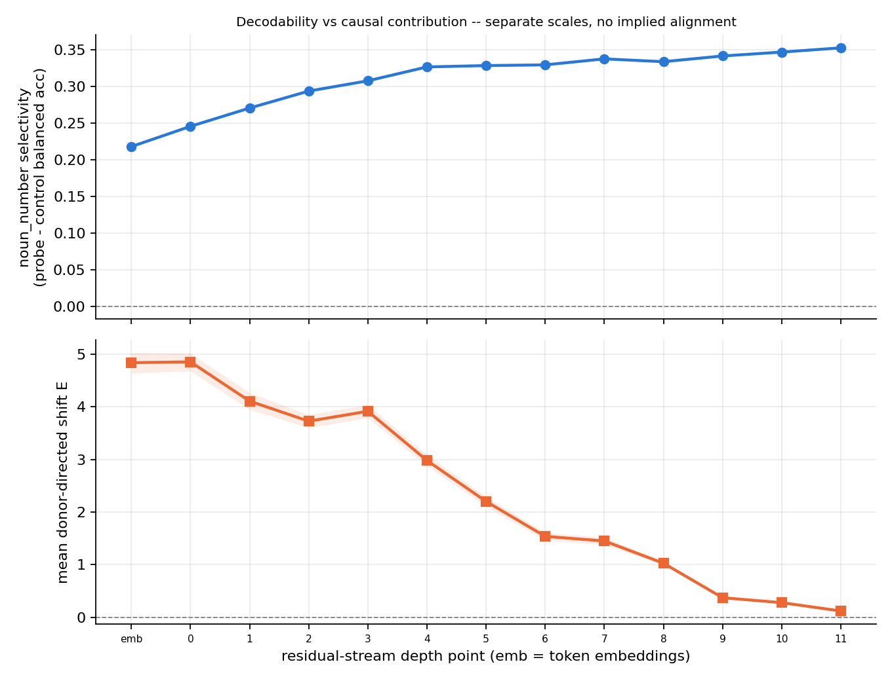
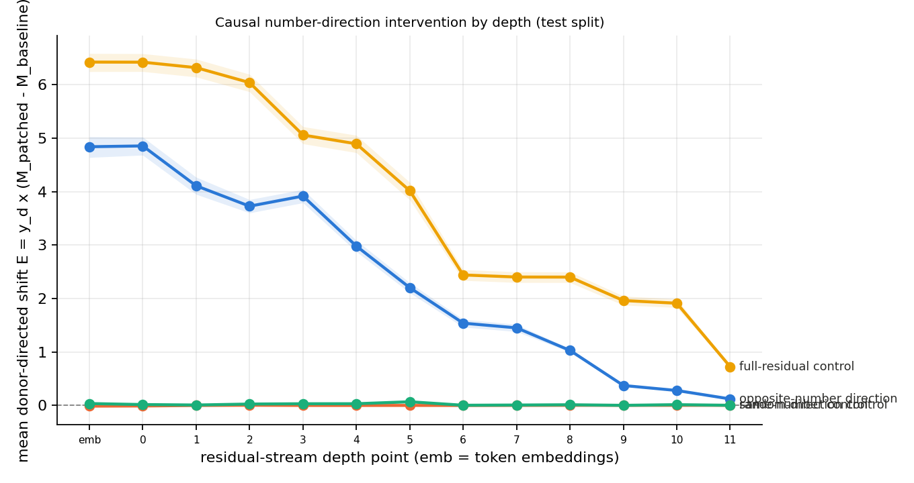

# P5 v1.1 -- Causal number-agreement intervention: does the decoded noun-number direction drive behaviour?

**Author:** Desmond Mariita.
**Model:** Pythia-160M (`EleutherAI/pythia-160m`), pinned revision `50f5173d`.
**Dataset:** UD English-EWT `r2.14` (CC BY-SA 4.0) for the noun lexicon; self-constructed
controlled stimuli for the intervention (no UD text committed).
**Status:** complete -- real run, confirmatory test split, generated 2026-09-23.
**Design:** pre-registered in
[ADR 006](../../docs/decisions/006-pythia-number-agreement-causal-intervention.md) and
`configs/causal.yaml`; design freeze `v1.1-design-freeze-5` (git `0b256c5`). Every number
below is read from `assets/causal_metrics.json` (no fabrication); `outputs/` artefacts are
gitignored and hashed.

---

## 1. Motivation: from decodability to causal use

v1.0 established that `noun_number` is strongly linearly decodable from Pythia-160M's
residual stream: probe balanced accuracy 0.983 at the embedding layer, selectivity rising
to 0.353 at `block_11`. But decodability -- even with a Hewitt & Liang control task -- does
not show that the model **uses** the decoded direction for behaviour. The unresolved
question is:

> **Does replacing only the noun-number coordinate of a subject representation with the
> coordinate from an opposite-number donor shift Pythia-160M's next-token verb preference
> toward the donor number?**

This is a causal contribution question about a representation, not a claim that we have
identified the unique mechanism or circuit for grammatical number.

## 2. Existing-v1 claim cleanup (bounded repair)

Before the extension, the v1.0 docs were audited and narrowly repaired (README.md,
REPORT.md, notebook, figure titles):

- **"Emergence" language.** The v1.0 probe is already near ceiling at the embedding layer
  (`noun_number` 0.983), so peak selectivity is not first availability. The v1.0
  "emergence" prose was replaced with: *peak selectivity*, *earliest depth statistically
  indistinguishable from the peak* (the descriptive CI-overlap rule), and *selectivity
  increases with depth* -- no claim that the property first appears at block 7/9/10.
- **Falling control accuracy.** The v1.0 sentence "the deeper residual stream carries
  progressively less raw word-type identity" was narrowed: a falling control score shows
  that **this particular linear control task** becomes harder to decode at depth; it does
  not prove that total lexical identity information has disappeared from the residual
  stream.
- **CI-overlap rule.** Marked explicitly as descriptive in REPORT/README/notebook: CI
  overlap is not a hypothesis test and is not proof of a transition point.
- **Probe accuracy vs selectivity.** Sharpened: raw probe accuracy is near ceiling at
  shallow depth, so the increasing selectivity is driven substantially by decreasing
  control accuracy -- which makes the causal intervention the decisive test.

No v1.0 result number was changed, and the v1.0 experiment was not rewritten into
something it was not.

## 3. Design freeze and v1.0 reproduction

The confirmatory design was frozen in `outputs/stimuli/design_freeze.json`:
**`v1.1-design-freeze-5`**, git SHA `0b256c5889da366f970b2458461f3ea5415ea87d`, manifest
SHA-256 `d6651d716815...` (full hashes in the manifest), stimulus-table SHA-256
`6a98507f...`, per-layer direction hashes, config hashes, splits, verb pairs, seeds, and
the gate definition. Freeze iterations -1 through -4 were pilot-plumbing corrections
(section 8 records the substantive one); none touched the pre-registered design. No
parameter/template change was made after the freeze; the test split ran exactly once.

The v1.0 pipeline was re-run first as a reconstruction gate: all 42 (property, point)
rows of `outputs/metrics.json` match the REPORT.md v1.0 tables within 0.0005 (float
extraction nondeterminism across machines). The refit `noun_number` probe matches the
v1.0 per-token predictions **exactly** at every depth point.

## 4. Competence gate (H1) -- PASSED

Pre-registered, evaluated on **un-intervened dev stimuli** before any intervention
(per (lemma, verb) row, `d = mean(M(plural subject) - M(singular subject))`;
lemma-cluster bootstrap, 2,000 resamples, seed 0):

| Gate | Definition | Result | Threshold | Pass |
|---|---|---|---|---|
| Gate 1 | paired subject-number effect: mean `d` | **7.1967**, 95% CI [7.0597, 7.3275] | CI strictly above 0 | **yes** |
| Gate 2 | directional cluster accuracy: share of (lemma, verb) rows with `d > 0` | **1.0000**, 95% CI [1.0, 1.0] | CI lower bound above 0.5 | **yes** |

Pythia-160M demonstrates strong, uniformly directional subject--verb agreement behaviour
under the pre-registered stimulus design (every one of 800 (lemma, verb) dev rows points
in the grammatical direction), so the causal number intervention is interpretable.

## 5. Stimulus construction

- **Templates.** `simple` (`The {subject}`), `near` (`The {subject} near the park`, neutral
  intervening context), `attractor` (`The {subject} near the {attractor}`, attractors
  `{park, parks, river, rivers, gate, gates, fence, fences}` with explicit number
  annotations). The prompt stem ends immediately before the target verb; the attractor
  surface is fixed across the matched singular/plural pair; both same-number and
  opposite-number attractor conditions arise per subject pair.
- **Verbs.** Target pairs (singular, plural): `(is, are)`, `(was, were)`, `(has, have)`,
  `(does, do)`. Tokenizer validation: every form is exactly one tokenizer token
  (leading-space convention); **no pair was excluded**.
- **Noun lexicon.** Derived deterministically from UD English-EWT train: NOUN tokens with
  `Number=Sing/Plur`, letter-only lowercase surfaces, most frequent surface per number,
  minimum frequency 3 per surface, degenerate pairs (plural == singular) excluded.
  **460 lemmas**: `suffix_transparent` 422 (plural == singular + s/es), `nontransparent`
  38 (a surface heuristic, not a linguistic morphology claim).
- **Subject alignment.** The intervention targets the subject's **last overlapping
  subword** (the v1.0 alignment convention, ADR 005 Decision 2). Subject positions and
  subword counts are recorded per stimulus; all 2,700 stimuli align, subject first-token
  position is 1 throughout.

## 6. Splits (anti-overfitting)

Pilot (first 5 sorted lemmas, all template families -- plumbing only), dev (200 lemmas,
`simple` + `near`), test (90 lemmas, `simple` + `near` + `attractor`). Lemma sets are
disjoint; the attractor template family is held out of dev. Stimulus rows: pilot 100,
dev 800, test 1,800 (2,700 total). Split seed 0; per-stimulus SHA-256 ids; table hash
committed in the freeze manifest. The test split was isolated before model evaluation and
run exactly once (confirmatory); the pilot was used only for tokenization/hook debugging.

## 7. Probe-direction recovery (train split only)

The `noun_number` probe was refitted per depth point under the v1.0 protocol (train split,
per-point StandardScaler, balanced LogisticRegression, C = 0.01 re-verified on dev, cap
60k, seed 0). Standardized coefficients were converted to the residual-space normal
`w_x = w_z / scale` and unit direction `u = w_x / ||w_x||`; class ordering was verified so
that **positive projection = plural** (no sign flips were needed). A unit test proves the
standardized score and the residual-space score agree up to the transformed intercept.
Reconstruction gate: the refit reproduces the v1.0 recorded balanced accuracies
(embedding 0.983, block_11 0.977) within 0.0005 -- **PASS**.

## 8. Intervention and controls

**Behavioural readout -- a pilot finding that nearly went the wrong way (recorded in
full).** During pilot plumbing validation, the next-token readout came under scrutiny:

1. The pinned pythia-160m checkpoint declares `tie_word_embeddings: false`, and its
   `safetensors` **contain a trained, untied `embed_out` output head**. GPT-NeoX/Pythia
   was trained with a separate output head, so the flag is truthful and transformers 5.9
   loads the head correctly.
2. A transient misdiagnosis assumed the architecture must be tied and switched the
   readout to `ln_f(h) @ embed_in.T`. That readout was empirically falsified: it produced
   nonsense continuations (e.g. `"The dog"` -> `" fraudulent"`), while the checkpoint's
   `embed_out` head produced grammatical continuations, and a perplexity check on four
   grammatical/ungrammatical agreement pairs favoured the grammatical reading by +0.78 to
   +1.45 nats/token. The tied readout was discarded and is not used anywhere.
3. The behavioural readout is therefore **`model.out.logits`** (the trained untied head)
   at the final stem position. Additionally, the behavioural passes run in **fp32**
   (`dtype=torch.float32`): at the checkpoint's native fp16, logits at the model's ~835
   scale quantize to ~1 ulp (~0.5) -- the same size as the intervention effects being
   measured. The v1.0 probing pipeline (fp16 extraction, upcast to fp64 before probing)
   is unchanged; its reproduction was verified before this finding surfaced.

These are plumbing corrections made during pilot validation, before any dev/test
evaluation; each was a re-versioned design freeze (v1.1-design-freeze-1 through -5).

**Intervention.** For recipient residual `h_r` and donor residual `h_d` at the subject
position and layer `l`: `h'_r = h_r + (u_l . h_d - u_l . h_r) * u_l` -- only the coordinate
along the decoded number direction is replaced; the orthogonal component is unchanged
(unit-tested). Layers: `embedding`..`block_11` (13 causal points); `ln_f` included only as
a terminal/no-downstream-mixing control; `block_11` doubles as a near-zero sanity point
(no attention layer remains to propagate the patch to a later prediction position --
lack of effect there is not absence of number information).

- **C0 no-op:** hooks active, no change. Reproduced baseline logits within tolerance on
  every split: **max |diff| = 0.00e+00** (bitwise).
- **C1 same-number donor:** coordinate replaced with a same-number donor (deterministic
  cyclic lemma pairing within template/attractor/number strata).
- **C2 random direction:** unit vector orthogonal to `u_l` (fixed seeds), norm-matched
  per example to the primary patch (`||delta_random|| = ||delta_number||`), K=3 seeds.
- **C3 full-residual replacement:** `h'_r = h_d` on the matched-tokenization subset only
  (2,620/2,700 rows eligible; pairs with unequal subject subword counts excluded).

Scoring convention (frozen): per item, `M = logit(plural_verb) - logit(singular_verb)`;
the donor-directed shift is `E = y_d * (M_patched - M_baseline)`, with `y_d` the donor's
number label for `number`/`full_residual`, the recipient's number for `same_number`, and
the opposite of the recipient's number for `random` (the specificity yardstick -- a
norm-matched non-number perturbation is scored against the direction the primary patch
targets).

## 9. Primary outcome (H2) -- POSITIVE at every layer

Mean donor-directed shift under the opposite-number direction patch, test split,
lemma-cluster bootstrap 95% CIs (unit = lemma; 100,800 items per layer):

| Layer | mean E | 95% CI | Layer | mean E | 95% CI |
|---|---|---|---|---|---|
| embedding | **4.839** | [4.638, 5.026] | block_6 | 1.537 | [1.463, 1.608] |
| block_0 | **4.854** | [4.682, 5.020] | block_7 | 1.450 | [1.380, 1.514] |
| block_1 | 4.108 | [3.948, 4.269] | block_8 | 1.027 | [0.995, 1.057] |
| block_2 | 3.727 | [3.601, 3.850] | block_9 | 0.371 | [0.357, 0.383] |
| block_3 | 3.916 | [3.790, 4.039] | block_10 | 0.277 | [0.267, 0.287] |
| block_4 | 2.980 | [2.876, 3.086] | block_11 | 0.119 | [0.115, 0.123] |
| block_5 | 2.201 | [2.105, 2.294] | ln_f (terminal) | 0.094 | -- |

**Every layer's CI excludes zero.** Replacing only the subject's coordinate on the
decoded number direction with an opposite-number donor's coordinate shifts the verb logit
contrast toward the donor number at every depth, with the strongest effect at the
embedding / block_0 (E ≈ 4.8 -- roughly 60% of the full-residual positive control's 6.4)
and a smooth decay to near zero at the deepest points.

**Causal-architecture diagnostic (as pre-registered).** A subject-position patch after
the final block has no attention layer left to propagate it to a **later** prediction
position. Exactly as predicted, `block_11` and `ln_f` effects are **0.0000** for the
`near` and `attractor` templates (verb predicted at a later position), and nonzero only
for the `simple` template (block_11 1.191, ln_f 0.935), where the subject position *is*
the prediction position and the patch acts directly. The terminal-control interpretation
is therefore exact per template.

## 10. Controls and specificity (H3, H4)

| Layer | same-number | random (K=3 mean) | full-residual |
|---|---|---|---|
| embedding | -0.015 | 0.033 | **6.424** |
| block_0 | -0.013 | 0.014 | 6.422 |
| block_3 | -0.003 | 0.029 | 5.059 |
| block_6 | -0.003 | 0.001 | 2.440 |
| block_9 | -0.000 | -0.001 | 1.961 |
| block_11 | 0.000 | -0.000 | 0.722 |
| (max |value| across layers) | 0.015 | 0.066 | 6.42 |

- **C1 same-number:** |E| <= 0.015 at every layer -- replacing the coordinate with a
  same-number donor leaves behaviour unchanged (magnitude/donor-variability control).
- **C2 random:** |E| <= 0.066 at every layer -- norm-matched perturbations in directions
  orthogonal to `u_l` do not move the contrast toward the donor number. The effect is
  **direction-specific** (H3 supported).
- **C3 full-residual:** positive at every layer (6.42 -> 0.72, all CIs above zero on the
  matched-tokenization subset) -- the broader positive control behaves as a superset of
  the direction-only effect (H4 supported).

**Secondary outcomes.** Donor-consistent shift rate: `number` **0.871** vs
`same_number` 0.434, `random` 0.483, `full_residual` 0.871. Verb-preference flip rate
under the number patch: 0.346.

**Subgroups (descriptive).** Template family (mean E, pooled over layers):
`simple` 3.78 > `near` 2.34 > `attractor` 2.05 (more intervening context weakens the
effect). Noun stratum: `suffix_transparent` 2.25 vs `nontransparent` 2.27 (no meaningful
gap). Attractor condition: same-number attractor 2.14 vs opposite-number 1.95. Baseline
agreement margin by stratum: transparent 3.19, nontransparent 3.32.

## 11. Decodability vs causal contribution (H5)

The two curves point in **opposite directions**: v1.0 `noun_number` selectivity **rises**
with depth (0.218 at embedding -> 0.353 at block_11), while the causal effect of
manipulating the decoded direction **decays** with depth (4.84 -> 0.12). This is the
pre-registered H5: decodability and causal effect are allowed to differ, and they
demonstrably do. Layers with stronger linear selectivity are *not* the layers where
manipulating the decoded direction most affects agreement behaviour. The comparison is
descriptive (13 points, adjacent layers not independent); no layerwise correlation is
claimed as evidence of a "grammatical-number circuit".

## 12. Limitations

- One model, one size (Pythia-160M), one domain; no scaling claim.
- The direction is a *decoded linear* direction; the result says nothing about uniqueness,
  necessity, complete mediation, or "the" grammatical-number circuit.
- The intervention replaces a coordinate at a single position (the subject's last
  subword); other positions (attractors, sentence start) are untouched, so the measured
  effect is a lower bound on what broader number-carriers could do.
- For the `simple` template the subject position is also the prediction position, which
  gives the deep-layer patches a direct route that intervening-context templates do not
  have (section 9 diagnostic); layerwise means are therefore pooled over two
  route-structures, and the primary claim does not rest on the deep layers.
- Layerwise comparisons are descriptive: adjacent layers are not independent and the
  number of layers is small.
- The noun strata are surface heuristics, not linguistic morphology classes.
- The logit scale of the pinned checkpoint is unusually large (~835); the fp32 readout
  decision (section 8) bounds the fp16 quantization concern, and M/E are contrastive
  quantities immune to a constant scale.

## 13. Exact claim boundary

> Replacing only the subject representation's projection on the decoded noun-number
> direction with the projection from an opposite-number donor shifted Pythia-160M's
> verb-number preference toward the donor at every layer (strongest at the embedding and
> block_0), relative to no-op, same-number, and norm-matched random-direction controls.
> This is evidence that the decoded direction makes a causal contribution to agreement
> behaviour under the tested intervention.

Explicitly **not** claimed: a unique mechanism; necessity of the direction; complete
mediation; a "grammar circuit"; general syntactic competence; "the model understands
number"; that probe selectivity proves causal use; that CI overlap proves layers are
equivalent; that nonsignificant = no effect (nothing here is nonsignificant, but the
reading rule is fixed).

## 14. Provenance

- Design freeze: `outputs/stimuli/design_freeze.json` (`v1.1-design-freeze-5`, git
  `0b256c5`, all hashes).
- Stimuli: `outputs/stimuli/stimuli.parquet`, `split_manifest.json`,
  `tokenizer_validation.json` (gitignored; hashes committed in the freeze).
- Directions: `outputs/probe/noun_number_direction/` (per-layer npz + manifest.json).
- Baseline + intervention rows: `outputs/stimuli/baseline/`, `interventions/`
  (gitignored; C0 tolerance check recorded per split).
- Authoritative aggregates (committed): `assets/causal_metrics.json`.
- v1.0 reproduction: `outputs/metrics.json` (gitignored) matches the REPORT.md tables
  within 0.0005 on all 42 rows.
- Every number in this report is cross-checked against `assets/causal_metrics.json`
  (see the report/snapshot consistency smoke test).
